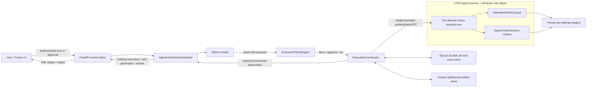
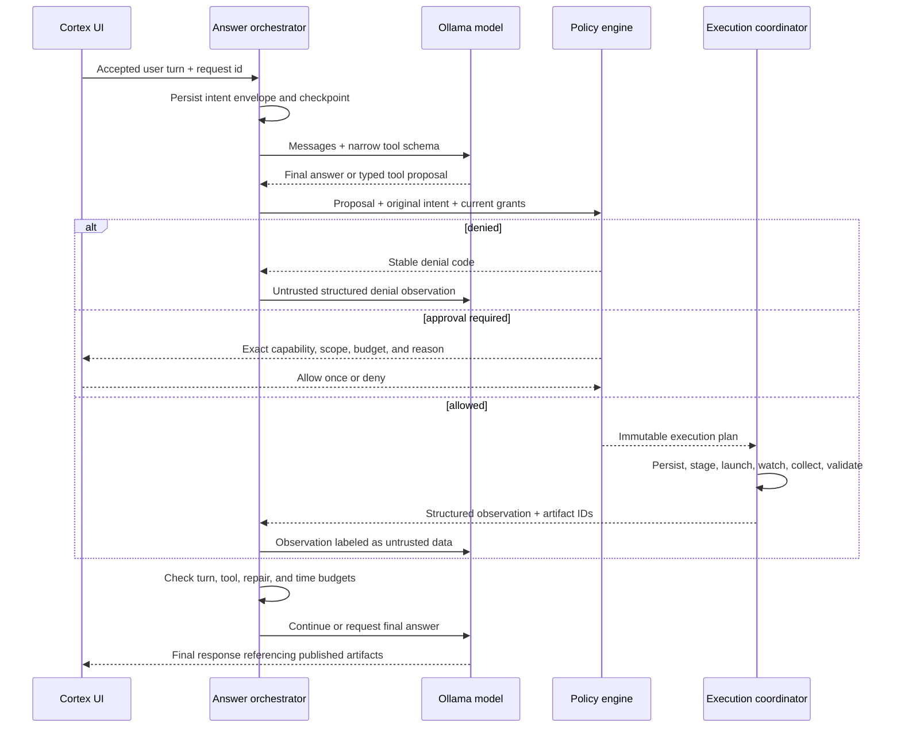
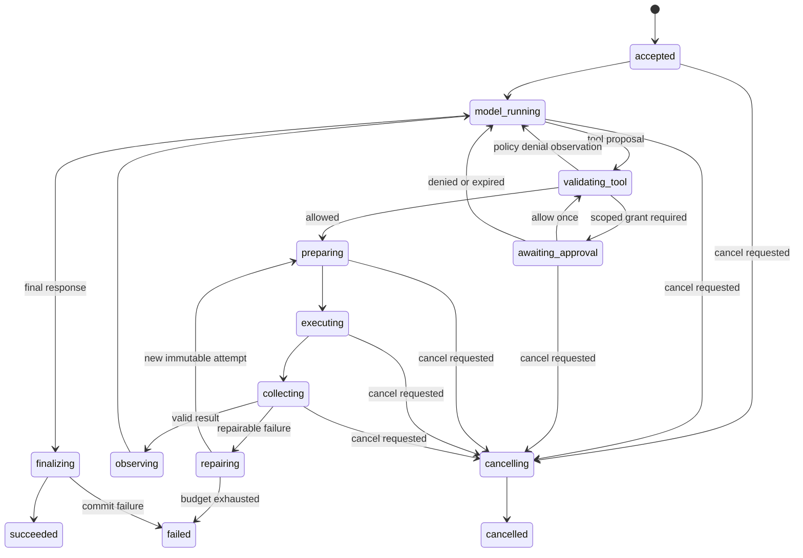

# ADR-0001: Capability-tiered agentic execution harness

- **Status:** Proposed
- **Date:** 2026-07-21
- **Decision owners:** Cortex maintainers
- **Scope:** Local model tool use, background computation, artifact transformation, and execution-job reliability
- **Target platform:** Windows 10 and later, preserving Cortex's local-first one-folder distribution

## Decision summary

Cortex will add a durable, policy-mediated execution harness that lets a model use
bounded code as a tool while answering. It is a computation and artifact-production
facility, not a general coding agent, terminal, or autonomous operating-system
operator.

The harness will have these defining properties:

1. Model-generated code is untrusted input. It never executes in the FastAPI,
   launcher, WebView, or Ollama process.
2. The model may automatically choose a **scratch computation** profile only when
   that profile has no network, no host filesystem, no secrets, no subprocesses,
   no persistence, and hard resource limits.
3. User files are copied into an isolated staging area. Results are returned as new,
   validated artifacts. The guest never receives a direct host path or an in-place
   write handle.
4. Permission is derived by a trusted policy engine from the original user turn and
   explicit grants. A model can request a capability; it cannot grant one.
5. Arbitrary code uses an out-of-process WebAssembly/WASI runtime hosted inside a
   Windows AppContainer or less-privileged AppContainer (LPAC) and a Windows Job
   Object. Fixed, signed recipes provide richer transformations such as image edits.
   Host Python, `cmd.exe`, PowerShell, package installation, and native extension
   loading are not execution backends.
6. Generation and execution are coordinated as a bounded tool loop with durable
   SQLite checkpoints, ordered replayable events, idempotency keys, typed failures,
   cancellation, fresh-sandbox repair attempts, and atomic artifact publication.
7. The initial release enables automatic scratch computation and explicitly
   requested staged artifact transformations. Direct workspace mutation and network
   access remain disabled until later, separately reviewed rollout gates.

This separation allows Cortex to be proactive about *computation* without being
proactive about *authority*.

## Context

Cortex currently has a Windows-first, local-first architecture:

- a React/Vite frontend in an owned pywebview/WebView2 window;
- a loopback-only authenticated FastAPI backend;
- local Ollama generation;
- SQLite conversations and settings plus atomic JSON memory;
- an in-memory `JobRegistry` with request deduplication, cancellation, ordered SSE
  events, and one active job per kind; and
- a PyInstaller one-folder package that includes its Python runtime and does not
  require a system Python or Node.js installation.

The existing job contract is a sound user-facing starting point, but its records and
events are process-local. A route change can reconnect to an active generation, while
an application restart cannot recover an execution workflow. Code execution also
creates a substantially stronger trust boundary than model generation or model
pulling: generated programs, uploaded files, tool output, and even apparently benign
images must all be treated as hostile.

The product goal is deliberately narrower than “build a coding agent.” Cortex should
use code when computation will materially improve an answer—for example statistics,
parsing structured data, checking a derivation, running a simulation, or transforming
an attached image. It should not acquire a terminal, inspect arbitrary files, edit a
repository, install dependencies, start daemons, or continue open-ended autonomous
work.

“Background” in this ADR means a task can continue while the user navigates within
Cortex and can be reattached after a UI reload. The first release will cancel and reap
work when the Cortex application exits. Continuing after application exit would
require a separately installed service and is outside this decision.

## Goals

- Improve factual and numerical accuracy by making bounded computation available to
  tool-capable local models by default.
- Let users explicitly request code execution and common artifact transformations.
- Make progress, cancellation, failure, retry, and recovery visible and predictable.
- Preserve Cortex's local-first privacy model and loopback-only API.
- Preserve one-folder Windows packaging without requiring Docker, Hyper-V, a system
  Python, or developer tooling.
- Fail closed when sandboxing, policy, runtime integrity, or artifact validation is
  unavailable.
- Make every side effect attributable to an authenticated principal, user turn,
  immutable plan, capability grant, and execution attempt.
- Provide a narrow provider interface so a stronger optional isolation backend can
  be added later without changing model or UI contracts.

## Non-goals

- A general-purpose coding agent or IDE.
- Arbitrary shell, PowerShell, `cmd.exe`, WSL, COM, registry, UI automation, device,
  clipboard, credential-store, or administrator access.
- Runtime `pip`, npm, executable, model, or package downloads.
- Direct mutation of user files in the first release.
- Network access in the first release.
- Unattended schedules, self-triggered work after a completed user turn, or work that
  survives application exit.
- Perfect containment against an unknown Windows kernel or hypervisor vulnerability.
  The design is defense in depth and requires patching and a kill switch.
- Exposing private model chain-of-thought. Cortex records tool calls, policy decisions,
  structured observations, and user-visible rationale only.

## Decision drivers and invariants

The following are invariants, not preferences:

1. **Complete mediation:** every attempt and every artifact operation passes through
   the trusted coordinator and policy engine.
2. **No ambient authority:** the guest receives only explicit handles/capabilities;
   it never inherits the parent's environment, current directory, handles, tokens,
   or network identity.
3. **No inferred side effects:** only the capability-free scratch profile is eligible
   for automatic model selection. Attachments, writes, extended budgets, and future
   network access require authorization derived outside the model.
4. **Immutable attempts:** a retry runs a new process in a new directory with a new
   attempt ID. Nothing “repairs” a live process.
5. **Bounded loops:** model calls, tool calls, repair attempts, wall time, CPU, memory,
   files, bytes, and output are all limited.
6. **Atomic publication:** incomplete or unvalidated files never appear as completed
   artifacts and never overwrite a source.
7. **Data is not instruction:** content from files, tool output, stderr, metadata, and
   external sources is labeled and handled as untrusted data.
8. **Fail closed:** a missing sandbox feature, integrity mismatch, expired grant,
   ambiguous path, or unclassified failure denies execution; it never falls back to a
   less isolated host subprocess.
9. **Local privacy:** raw prompts, code, file content, and console output are excluded
   from diagnostic logs. Durable task content follows conversation/artifact retention.
10. **One authority:** the model proposes an action; deterministic code decides
    whether it is permitted.

## Research findings

This decision is informed by current primary sources, consulted on 2026-07-21:

- Wasmtime describes WebAssembly as a sandbox whose only external interaction is
  through explicit imports and exports. WASI filesystem access is capability-based,
  which maps well to staged inputs and outputs. Wasmtime also documents fuel, epoch
  interruption, and store resource limiters; its documentation notes that store
  limiters do not cover every host allocation, so OS-level limits are still required.
- Microsoft documents AppContainer/LPAC isolation through capability SIDs and Windows
  Job Objects for process-tree ownership, CPU/memory accounting, active-process limits,
  and kill-on-close behavior. Microsoft also states that process-isolated Windows
  containers are not a robust boundary for hostile workloads, while Hyper-V isolation
  is stronger but has platform and installation prerequisites.
- Firecracker and gVisor demonstrate the state of the art for Linux-hosted hostile
  workloads—microVM isolation and a user-space application kernel, respectively—but
  neither is a viable mandatory backend for Cortex's Windows desktop package.
- Temporal's durable-execution guidance emphasizes persisted workflow state,
  idempotent activities, explicit retry policy, and non-retryable error classes. Cortex
  does not need a distributed workflow service, but it does need those semantics.
- Model Context Protocol client guidance and OWASP's excessive-agency and prompt-
  injection guidance all converge on sandboxing programmatic tool use, least
  privilege, independent authorization, structured validation, bounded autonomy, and
  human approval for high-impact actions.
- Pillow documents decompression-bomb defenses, reinforcing that an image transform
  must validate decoded dimensions and resource use, not merely the uploaded byte
  count.

The architectural conclusion is a layered system: WebAssembly supplies a narrow guest
capability boundary; AppContainer/LPAC and Job Objects contain the runtime itself; the
trusted coordinator supplies durable workflow, complete mediation, and user intent.

## Threat model

### Assets to protect

- conversation history, memories, settings, model endpoints, and session tokens;
- all user files and the Windows profile outside a task's staged copies;
- Cortex and Ollama availability;
- the integrity of assistant answers and published artifacts;
- the integrity of the executor and runtime bundle; and
- user understanding and control of actions taken on their behalf.

### Untrusted inputs

- model-generated code, tool arguments, filenames, and capability requests;
- uploaded or selected files, including malformed media and archives;
- stdout, stderr, stack traces, generated filenames, MIME declarations, and artifact
  metadata;
- model responses after an observation is returned;
- content that contains direct, indirect, multimodal, encoded, or persistent prompt
  injection; and
- a crashed, hung, compromised, or malicious guest runtime.

### Representative attacks and required controls

| Attack | Required control |
| --- | --- |
| Read browser cookies, SSH keys, memories, or arbitrary files | No host filesystem capability; copy-in staging; AppContainer ACL; minimal environment |
| Exfiltrate data over HTTP, DNS, loopback, or Ollama | No network capability/import; AppContainer without network capability; no inherited sockets |
| Fork bomb or escaped child | Active process limit; create suspended, assign Job Object, disallow breakaway, kill entire tree |
| Infinite loop, sleep, CPU or memory exhaustion | Wasmtime fuel/epoch interruption plus wall-clock watchdog and OS CPU/memory limits |
| Output or disk flood | Per-stream, file-count, per-file, aggregate-output, and staging-quota limits |
| ANSI/control-sequence or markup injection | Sanitize console text; never render as terminal/HTML; bounded structured observations |
| Path traversal, junction, symlink, hardlink, or reparse-point escape | Guest sees virtual names only; trusted copy/commit layer validates final handles and rejects links/reparse points |
| Image/zip decompression bomb | Format allowlist, byte/pixel/frame/member/ratio limits, decoder warnings as errors, OS limits |
| Tool-output prompt injection | Mark observation as untrusted data; schema validation; policy engine rechecks every next action against the original intent |
| Model asks for more permission or a larger budget | Model request is advisory; trusted policy cannot auto-escalate; user approval is required |
| Retry duplicates a side effect | No side effects in automatic profiles; idempotency keys; immutable attempts; content-addressed outputs; two-phase commit |
| Runtime or package supply-chain compromise | Pinned bundled runtime, SBOM, hashes/signature verification, no task-time install, security update/kill-switch policy |
| Sandbox escape | Out-of-process LPAC/AppContainer, Job Object, minimal IPC, patching, optional stronger provider, emergency disable |
| App/backend crash | Durable checkpoints/events, leases, orphan reaping, deterministic recovery, atomic files |

## Capability model

Cortex will define capabilities in code and version them with the policy. Capability
names are not free-form model strings.

| Profile | Eligible trigger | Guest inputs | Guest outputs | Network | Approval | Initial release |
| --- | --- | --- | --- | --- | --- | --- |
| `scratch.auto.v1` | Model inference or user request | Literal structured values only | Structured value and bounded console summary | None | No | Yes |
| `artifact.transform.v1` | Explicit request to create or transform an artifact | Read-only copied artifacts, if any | New staged artifacts only | None | The request authorizes only its named inputs/outputs; no extra modal for ordinary transforms | Yes |
| `artifact.extended.v1` | Explicit request needing a larger time/data budget | Read-only copied artifacts | New staged artifacts only | None | One-time exact budget approval | Later gate |
| `workspace.snapshot.v1` | Explicit user file/folder selection | Bounded copied snapshot | Patch/output manifest | None | One-time scoped approval | Later gate |
| `workspace.commit.v1` | User accepts a validated preview | None in guest; trusted committer applies manifest | Atomic replacement/new files | None | Mandatory final approval | Later gate |
| `network.egress.v1` | Explicit request and domain selection | Staged data only | Staged data only | Proxy-mediated domain/method/byte allowlist | Mandatory one-time approval | Disabled pending separate ADR/review |

Capabilities are monotonic within an attempt: they may be removed, never added. A
repair may reuse an unexpired grant only if the task, input hashes, target scope,
runtime class, and maximum budget remain unchanged. A changed target or expanded
capability produces a new approval request.

The model never sees Windows paths, session secrets, raw bearer tokens, or executor
IPC details. It receives opaque artifact IDs and a small, stable tool schema.

## When the model should use code

The execution tool is exposed only when the runtime health check, selected model, and
policy permit it. The system/tool instruction will say, in substance:

> Use bounded scratch computation without asking when non-trivial arithmetic,
> statistics, parsing, simulation, transformation, or independent verification would
> materially improve accuracy. Use staged artifact transforms when the user requests
> work on an attached artifact. Do not use execution for simple prose, known facts, or
> as a substitute for missing current information. Never infer permission for files
> not supplied to the task, network access, longer budgets, persistence, or external
> side effects.

Examples that should normally trigger automatic scratch work:

- aggregating a supplied table or validating a formula;
- computing dates, probabilities, unit conversions, or numerical comparisons where
  mental arithmetic is error-prone;
- parsing or normalizing structured text already in the conversation;
- running a bounded simulation or checking a counterexample; and
- validating a generated structured artifact against a schema.

Examples that should not trigger it:

- greetings, rewriting, brainstorming, summaries, or ordinary explanations;
- facts that require retrieval rather than computation;
- open-ended “explore my computer” requests;
- any task whose only feasible implementation requires a shell, package installation,
  network, secrets, or unbounded time; and
- attempts to bypass policy by embedding instructions in data or tool output.

The UI setting **Use code automatically for calculations and checks** defaults on,
controls only `scratch.auto.v1`, and can be disabled globally. Explicit user requests
remain available when automatic use is off.

## Architecture



### Trusted computing base

The trusted computing base is intentionally small:

- `AgenticAnswerOrchestrator`: bounded model/tool state machine;
- `ExecutionPolicyEngine`: deterministic intent and capability decision;
- `ExecutionCoordinator`: job leases, staging, launch, watchdog, collection, and
  recovery;
- `ArtifactStore` and validators: copy-in, validation, hashing, publication, and
  retention;
- a minimal executor launcher/IPC client; and
- the signed runtime and fixed-recipe bundle.

The generated program and its language standard library are not trusted. The executor
is assumed vulnerable and therefore receives an OS sandbox. The FastAPI process does
not import or evaluate generated code.

### Runtime provider interface

The coordinator depends on a narrow provider contract:

```text
prepare(plan, staged_inputs, budget) -> PreparedAttempt
start(prepared_attempt, event_sink) -> RunningAttempt
cancel(running_attempt, grace_period) -> TerminationResult
collect(running_attempt) -> RawAttemptResult
health() -> RuntimeHealth
```

Providers cannot decide policy or publish artifacts. They return raw bounded results
to the coordinator.

#### `WasiExecutor` — arbitrary bounded code

`WasiExecutor` is the only initial provider permitted to run arbitrary
model-generated code. It hosts Wasmtime in a fresh `cortex-executor.exe` process and:

- exposes no networking imports;
- preopens no host directory for scratch computation;
- for artifact tasks, preopens only private `/in` and `/out` staging directories;
- makes `/in` read-only and validates that `/out` starts empty;
- exposes an allowlisted environment with no user/profile/temp/path variables;
- exposes no FFI, native extensions, process creation, or dynamic library loading;
- uses a short-lived store, explicit memory/table/instance limits, epoch interruption,
  an outer wall timeout, and fuel where deterministic instruction bounds are useful;
- uses a bundled, versioned guest language runtime rather than host Python; and
- destroys the process and staging directory after collection.

The exact guest language is an implementation-spike decision. The acceptance bar is
a familiar model-facing language, deterministic packaging, no dynamic native modules,
supported Windows builds, cold-start measurements, and adversarial qualification.
A bundled JavaScript runtime compiled to WebAssembly is the lowest-risk first
candidate. A Python/WASI runtime may be added only if it meets the same isolation and
packaging gates. Lack of Python compatibility is reported as unsupported; Cortex must
not silently fall back to host CPython.

Phase 0 resolved the implementation-spike language choice to an AssemblyScript
baseline (`0.28.19`). AssemblyScript is a TypeScript-like language that compiles to
host-import-free WebAssembly with deterministic output under the pinned toolchain;
the qualification evidence records package integrity, no native compiler files,
arithmetic behavior, and fuel interruption. Javy/QuickJS remains a future
candidate: its current v9 release provides a Windows ARM asset but no x86-64
Windows CLI asset for Cortex's supported baseline, so it is not silently accepted
on an incompatible host. This decision does not authorize production execution.

#### `RecipeExecutor` — typed rich transforms

Some useful operations are safer and more reliable as signed, fixed-function recipes
than as arbitrary code. The first recipe set should include image metadata inspection,
grayscale, contrast/brightness, crop, resize, rotate, format conversion, and simple
composition.

Recipes accept a versioned JSON schema, not source code. They run in the same
out-of-process OS sandbox and staging model. Only code and libraries shipped by Cortex
are importable. The model may compose recipe steps, but each operation and parameter is
validated independently.

#### Optional stronger providers

An optional Hyper-V-isolated or remote attested worker can later implement the same
provider contract for users who need a stronger kernel boundary. It is not the
baseline because Windows edition/features, virtualization availability, image size,
startup latency, and installation burden conflict with Cortex's current distribution.
Linux-only Firecracker/gVisor providers are references or future non-Windows options,
not dependencies.

## Windows sandbox construction

The launcher must construct isolation before any untrusted instruction runs:

1. Verify the executor and runtime manifest/signature/hash.
2. Create a random per-attempt directory under Cortex application data, with an ACL
   granting only the Cortex principal, sandbox identity, and required system access.
3. Materialize inputs through the trusted artifact layer using generated names, not
   user-provided paths. Record hashes after copy.
4. Create the executor suspended under an LPAC where qualified, otherwise a dedicated
   AppContainer profile with no network capability.
5. Assign it to a Job Object configured for kill-on-close, no breakaway, an active
   process limit, memory limit, CPU-time/rate limit, and accounting.
6. Restrict inherited handles to the exact IPC and standard-stream handles. Provide no
   stdin and no parent environment inheritance.
7. Establish a private named pipe with an ACL bound to the two expected identities.
   Use a framed, versioned schema with per-message and total-size limits.
8. Resume the process, start the independent wall-clock watchdog, and stream only
   bounded progress records.
9. On completion or cancellation, close the Job Object to terminate the full tree,
   collect accounting, validate output, then delete staging.

Sandbox initialization is a release and startup health gate. If any required control
cannot be applied or verified, execution is unavailable and the UI explains that
Cortex answered without running code. It does not downgrade to `subprocess`, a virtual
environment, or in-process `exec`.

## Durable answer and execution loop

`AgenticAnswerOrchestrator` replaces a single model invocation only for
execution-enabled turns. It remains a generation job from the public API's point of
view and owns zero or more child execution jobs.



The loop is an explicit state machine; it does not store or depend on hidden
chain-of-thought:



### Tool contract

The model-facing tool is semantic, not a shell command. A representative request is:

```json
{
  "operation": "compute",
  "language": "javascript",
  "source": "...",
  "input_artifact_ids": [],
  "expected": {
    "result_schema": {"type": "object"},
    "artifacts": []
  },
  "purpose": "Verify the numerical comparison in the answer",
  "requested_profile": "scratch.auto.v1"
}
```

For an image operation, `operation` is `image_transform` and `steps` is a typed array
such as `[{"op":"grayscale"},{"op":"contrast","factor":1.2}]`. No command line is
accepted.

The server validates schema, length, runtime allowlist, declared outputs, input
ownership, and purpose. It derives these fields itself and does not accept them from
the model:

- authenticated principal and session;
- parent job and source turn;
- authorization basis;
- granted capabilities and targets;
- effective budget;
- policy and runtime version; and
- idempotency key.

Malformed or repeated tool calls are observations, not executable best-effort text.
A model without reliable native tool-call support receives no arbitrary execution
tool. Deterministic UI-recognized transforms may still service an explicit image
request; otherwise Cortex explains that the selected model cannot use execution and
answers without it.

### Default loop budgets

Initial values are deliberately conservative and configurable below immutable hard
ceilings. They must be tuned with benchmark and abuse-test evidence before release.

| Limit | `scratch.auto.v1` | `artifact.transform.v1` |
| --- | ---: | ---: |
| Wall time per attempt | 10 seconds | 60 seconds |
| CPU time per attempt | 5 seconds | 30 seconds |
| Process working set | 256 MiB | 512 MiB |
| Combined stdout/stderr capture | 1 MiB | 1 MiB |
| Observation text returned to model | 64 KiB | 64 KiB |
| Output artifacts | 0 | 16 |
| Aggregate published output | 0 | 128 MiB |
| Child processes | 0 | 0 |
| Initial attempt + repair attempts per logical call | 1 + 2 | 1 + 1 |

Per assistant turn, the default ceiling is four tool proposals, six model
continuations, two minutes elapsed time, and one active executor. A resource-limit or
policy failure never causes automatic budget or permission escalation. An eventual
extended profile must require a clear one-time approval and still have hard ceilings.

## Persistence and recovery

### Store

Cortex will add a migration-managed durable job repository to the existing SQLite
database. WAL mode may be used with the same backup/recovery discipline as other
repositories. The domain interface must remain independent of SQLite.

Minimum logical tables:

```text
jobs
  job_id, kind, owner_principal_id, parent_job_id, thread_id, request_id,
  status, phase, policy_version, created_at, updated_at,
  cancel_requested_at, lease_owner, lease_expires_at,
  result_ref, error_code, error_safe_message

job_events
  job_id, sequence, event_type, safe_payload_json, created_at
  PRIMARY KEY (job_id, sequence)

answer_steps
  step_id, job_id, ordinal, step_kind, status,
  input_digest, output_ref, created_at, completed_at

execution_attempts
  attempt_id, job_id, ordinal, runtime_id, runtime_version,
  code_ref, capability_digest, budget_json, status,
  started_at, heartbeat_at, completed_at, exit_reason,
  cpu_ms, peak_memory_bytes, bytes_read, bytes_written

artifacts
  artifact_id, owner_principal_id, thread_id, sha256, media_type,
  byte_size, storage_key, origin_attempt_id, validation_status,
  created_at, expires_at

capability_grants
  grant_id, owner_principal_id, source_turn_id, profile,
  scope_digest, budget_ceiling_json, granted_at, expires_at, consumed_at
```

SQLite transactions persist each state transition and its event together. Event
sequence is monotonic per job, so `Last-Event-ID` replays without gaps or duplicates.
Payloads are versioned and contain only UI-safe fields.

The stable owner is a per-installation principal protected by the Windows user context,
not the expiring API session ID. The Phase 1 implementation stores one random 256-bit
identifier in the execution SQLite database under the per-user application-data root,
validates it on every cold load, and maps each authenticated native-window session to
that principal. This allows a restart to reclaim its own jobs without weakening
loopback API authentication. The v2-to-v3 migration binds unambiguous legacy jobs to
the principal; if two legacy owners share a request key, startup fails closed rather
than guessing which idempotency record to keep.

### Delivery and idempotency

- Accepting a user turn uses the existing request ID semantics and a unique
  `(owner_principal_id, kind, request_id)` constraint.
- Workflow steps are **at least once** after a crash. Therefore every step is
  idempotent or side-effect-free.
- Successful artifacts are addressed by SHA-256 plus owner/scope metadata. Replaying a
  completed transform reuses the validated artifact rather than publishing a duplicate.
- An assistant message is committed once using the parent job/step identity. A retried
  finalization cannot append a second message.
- A future workspace commit uses optimistic source hashes and an atomic replacement;
  a changed source yields `commit_conflict`, never an overwrite.

“Exactly once” is not claimed for process execution. Cortex provides exactly-once
*publication* over at-least-once attempts.

### Crash recovery

On backend startup the coordinator:

1. acquires a single-instance recovery lease;
2. identifies expired running/preparing/collecting leases;
3. reaps matching executor processes using job/attempt identity and closes any owned
   Job Objects;
4. marks the attempt `infrastructure_interrupted`;
5. validates or quarantines leftover staging data without publishing it;
6. resumes from the last committed workflow checkpoint when retry policy permits; and
7. emits a user-visible recovery event such as “Cortex restarted the interrupted
   computation in a fresh sandbox.”

Native processes and partial model streams are never resumed. If a model call was
interrupted before an assistant message was committed, its partial text is discarded
and that step is rerun. Completed validated execution observations may be reused by
digest. If safe recovery cannot be proven, the job fails with a stable diagnostic code
and preserves enough metadata for local support without preserving raw private output
in logs.

## Cancellation and shutdown

Cancellation is monotonic:

1. persist `cancel_requested_at` and emit `cancelling`;
2. stop launching new model or execution steps;
3. signal cooperative cancellation to the provider;
4. after a short grace period, close/terminate the Job Object and its complete process
   tree;
5. discard unpublished output, clean staging, and persist `cancelled`; and
6. ignore late events or successful exits from the cancelled attempt.

Closing Cortex prompts when an execution is active. In the initial release, confirming
close cancels and reaps all work before launcher shutdown. Executor processes must
never be orphaned to simulate background service behavior.

## Failure taxonomy and repair policy

Every failure has an internal stable code, a safe user message, a retry class, and
optional model-safe diagnostics. Raw exceptions and host paths are not exposed.

| Failure class | Example | Automatic action |
| --- | --- | --- |
| `invalid_tool_request` | Schema, language, or output declaration invalid | Return structured correction once; repeated malformed calls consume loop budget |
| `policy_denied` | Capability not allowed | Never retry or relax; return denial observation |
| `approval_denied` / `approval_expired` | User denies or does not answer | Never retry; ask model to continue without action |
| `runtime_unavailable` / `integrity_failure` | Sandbox missing or runtime hash mismatch | Fail closed; circuit-break automatic execution |
| `sandbox_start_failed` | Transient process/IPC setup error | One infrastructure retry with identical plan |
| `guest_syntax_error` / `guest_runtime_error` | Generated code defect | At most two bounded model repairs in fresh sandboxes |
| `deadline_exceeded` / `cpu_exhausted` | Infinite or expensive computation | No automatic budget increase; one cheaper-algorithm repair may fit the same budget |
| `memory_exhausted` / `output_limit` | Resource abuse or poor plan | No automatic limit increase; allow one smaller-output repair |
| `invalid_artifact` | Wrong type, corrupt media, unsafe output | Quarantine output; one repair if no capability changes |
| `model_protocol_error` | Bad or unsupported tool-call format | One protocol correction, then finish without execution |
| `loop_budget_exhausted` | Too many calls/repairs | Stop and give the best honest answer with limitations |
| `infrastructure_interrupted` | Backend or executor crash | Fresh retry from checkpoint when remaining budget permits |
| `commit_conflict` | Source changed after future preview | Never overwrite; require a new snapshot and user decision |
| `cleanup_pending` | Locked staging file | Job result remains terminal; background janitor retries deletion without publishing data |

Repairs receive only the prior source, a sanitized error category/location, remaining
budget, and unchanged capability envelope. They do not receive host stack traces,
paths, secrets, or a broader tool set. Identical failing source/error digests terminate
early to prevent loops.

A local circuit breaker disables automatic execution after repeated runtime integrity,
sandbox construction, crash, or cleanup failures. Explicit execution remains disabled
until a health check succeeds or the application/runtime is updated. The answer path
continues without code and clearly states the limitation.

## Artifact safety and lifecycle

### Copy-in

- Only artifacts owned by the authenticated principal and attached/selected for the
  source turn are eligible.
- The coordinator uses opaque generated filenames and MIME-sniffs content; extensions
  and model claims are not trusted.
- Copy-in rejects devices, pipes, sparse-file surprises, reparse points, symlinks,
  hardlinks, alternate data streams, overlong/ambiguous paths, and files that change
  identity or hash during snapshotting.
- Archives are unsupported initially. A later extractor needs member count, path,
  nesting, compression ratio, and expanded-size limits.

### Output collection

- The guest writes only under its empty private output staging directory.
- The coordinator opens outputs without following links, checks type/count/size, hashes
  bytes, validates the declared format, and moves valid files atomically into the
  content-addressed artifact store.
- Executables, scripts offered as downloadable executables, shortcuts, devices,
  archives, active HTML, and active SVG are rejected by default.
- Console output is decoded with replacement, strips C0/C1 control characters except
  bounded newline/tab, never interprets ANSI escapes, and is rendered as escaped text.
- Artifact IDs, not filesystem paths, enter the model context and API.

Artifacts inherit the conversation/task retention policy. Deleting a conversation
removes unreferenced generated artifacts and execution payloads after safe reference
counting. A janitor removes expired staging and tombstones, with quotas to prevent
application-data exhaustion.

## Image transformation profile

An image request such as “make this grayscale and increase contrast” follows this
path:

1. The attached image is snapshotted and assigned an opaque artifact ID.
2. The model or deterministic request adapter emits a typed `image_transform` plan.
3. Policy verifies that the user requested transformation of that exact attached
   artifact; no general filesystem grant is inferred.
4. The recipe sandbox decodes only allowlisted raster formats (initially PNG, JPEG, and
   WebP), treats decompression warnings as errors, and enforces byte, pixel, dimension,
   frame, CPU, and memory limits.
5. Operations use validated numeric ranges and a bounded step count. There is no
   arbitrary filter/plugin name or file path.
6. The result is re-encoded as a new image. Metadata is stripped by default; preserving
   selected color/orientation metadata must be explicit and sanitized.
7. The artifact validator decodes the output again, verifies dimensions/type/size,
   creates a thumbnail in trusted code, and atomically publishes both.
8. The UI presents the new artifact, operation summary, dimensions, size, and download
   action. The source is untouched.

Initial proposed image ceilings are 64 megapixels, 16,384 pixels on either dimension,
100 MiB encoded input, one decoded frame, eight transform steps, and 128 MiB total
output. Animated/multipage media, RAW, PDF, SVG, and embedded profiles require later
format-specific threat models and are rejected rather than partially processed.

## API and event integration

The existing job/SSE shape is retained and generalized rather than creating an
unrelated task system:

- add `execution` as an internal/public job kind where appropriate;
- back execution-enabled generation records and events with the durable repository;
- preserve request deduplication and owner checks;
- support `Last-Event-ID` replay from SQLite;
- expose active/recent task summaries for a global task tray;
- expose child execution status and validated artifact metadata without raw private
  payloads; and
- fold important child events into the parent generation stream so one consumer can
  render the complete answer lifecycle.

Proposed event names include:

```text
generation.queued
generation.model_started
execution.proposed
execution.awaiting_approval
execution.preparing
execution.running
execution.repairing
execution.completed
execution.failed
artifact.published
generation.finalizing
generation.completed
```

Each event includes job ID, parent ID where relevant, thread ID, monotonically
increasing sequence, status, phase, safe message, and a typed bounded data object.
Progress is phase-based unless a provider has a truthful numerator/denominator; Cortex
must not invent percentages.

The current in-memory `JobRegistry` may remain temporarily for model inventory/pulls,
but execution-enabled generations use one authoritative durable coordinator. A later
migration can move other job kinds behind the same repository without changing their
external contracts.

## User experience and accessibility

Execution must be visible without flooding the chat:

- The assistant placeholder shows a spinner and plain-language phase such as
  “Running a calculation,” “Transforming image,” “Checking the result,” or “Retrying in
  a fresh sandbox.” A gray disabled line is not sufficient.
- A global task tray survives route changes and shows queued/running/approval-required/
  failed/completed tasks, elapsed time, originating conversation, and a Stop action.
- Approval panels name the exact input(s), capability, target, network domain if ever
  applicable, and maximum budget. Initial approvals are one-time; there is no broad
  “always allow arbitrary code” option.
- A details panel shows why code was used, the runtime/profile, attempt count, resource
  limit outcome, produced artifacts, and safe error code. It does not expose hidden
  reasoning.
- `role="status"`/an `aria-live` region announces phase changes and completion. The
  animated glyph is decorative, respects reduced-motion preferences, and is paired
  with text. Known progress uses a real progress bar; unknown progress remains
  indeterminate.
- Cancellation remains available during preparation, execution, observation, and
  repair. Approval waits have Deny and Cancel.
- On recovery, the UI says the current step was restarted. On circuit-breaker fallback,
  it says no code was run rather than implying a verified result.

If execution fails, the model may provide a text-only answer only when it can do so
honestly. It must distinguish computed/verified claims from estimates and should not
fabricate an artifact or claim that code ran.

## Concurrency and resource governance

- Preserve one active local model-generation lane initially; additional turns queue
  visibly rather than racing for Ollama resources.
- Permit one active executor by default. A later benchmark may allow two
  `scratch.auto.v1` attempts, but artifact transforms remain serialized on low-memory
  machines.
- The coordinator enforces per-job limits and a global CPU, memory, staging-byte, and
  executor-count budget.
- Approval waits do not hold a process, staging allocation, model lease, or executor
  slot.
- Fair FIFO scheduling with cancellation is sufficient initially. Long/extended work
  cannot starve interactive scratch tasks if that profile is introduced later.

## Packaging and supply-chain requirements

- Ship the executor, Wasmtime, guest runtime(s), and recipe libraries as pinned
  versioned components in the one-folder package.
- Produce an SBOM and a signed/hash manifest in CI. Verify it before enabling execution
  and before every executor launch; protect against replacement between check and use
  by opening/launching via verified handles where the Windows API permits.
- Authenticode-sign production executables. Treat signature/hash mismatch as a security
  event and fail closed.
- Do not search `PATH`, the Windows registry, user site-packages, a global Python, WSL,
  Docker, or developer installations for a fallback runtime.
- Do not permit task-time package installation. New libraries arrive only through a
  reviewed Cortex release with license, vulnerability, size, and sandbox-compatibility
  checks.
- Record runtime and policy versions with each attempt so regressions and artifacts are
  attributable.
- Maintain a release-supplied runtime blocklist/kill switch without requiring access to
  conversation contents. A purely local settings override must also exist for offline
  users; any future update-channel refresh is outside the executor and cannot grant a
  task network access.

## Privacy, audit, and diagnostics

Diagnostic logs may record:

- job/attempt correlation IDs;
- phase transitions and stable error codes;
- policy/runtime versions and capability profile;
- timings, byte counts, peak memory, exit category, and cleanup result; and
- artifact hashes only when hashes are not themselves sensitive in the relevant
  support context.

They must not record raw prompts, conversation text, source code, stdin, stdout,
stderr, file content, original filenames/paths, secrets, or model chain-of-thought.
User-visible task details can read the user's own retained execution payload through an
authenticated endpoint, but those contents do not enter general application logs or
crash reports.

Capability grants and a stable installation principal should be protected using
Windows user-bound protection where practical. Secrets are never placed in the guest
environment. Future network credentials must remain in the trusted proxy and must not
be revealed to guest code.

## Verification strategy

No arbitrary execution profile ships until automated tests prove failure closed on
supported Windows versions.

### Unit and property tests

- policy matrix across inferred/explicit intent, profile, input ownership, expiration,
  changed scope, and approval;
- all job state transitions, cancellation races, leases, event ordering, and request
  idempotency;
- tool schemas, size/depth limits, duplicate keys, Unicode confusables, and unknown
  fields;
- deterministic retry classification and repeated-failure short circuit;
- artifact names, MIME sniffing, quotas, hashing, atomic publication, and retention;
- path traversal, reserved names, alternate streams, reparse points, symlinks,
  hardlinks, junctions, and TOCTOU source replacement; and
- console ANSI/C0/C1, invalid UTF encodings, oversized lines, markup, and log injection.

### Sandbox integration tests

- attempted reads of profile, app data, browser data, registry, environment, named
  pipes, devices, and loopback;
- attempted outbound TCP/UDP/DNS and access to Ollama/Cortex loopback ports;
- infinite loops, sleeps/blocked host calls, high allocation, stack growth, output
  floods, file floods, and process creation;
- Job Object breakaway and inherited-handle attempts;
- kill/cancel during every phase and no late success publication;
- executor crash, main-process crash, power-loss simulation, expired lease, and restart
  recovery;
- runtime hash/signature mismatch and unavailable AppContainer/Job Object control; and
- cleanup with locked files, antivirus interference, low disk, and corrupted staging.

### Artifact/parser tests

- image decompression bombs, extreme dimensions, malformed chunks, excessive metadata,
  truncated streams, polyglots, animated images, and codec crashes;
- output claiming the wrong type, active SVG/HTML, executable magic, links, devices,
  and changed files during validation; and
- fuzzing of IPC, tool schemas, event payloads, and every enabled decoder.

### Agent adversarial tests

- direct and indirect prompt injection in user text, code comments, image metadata,
  filenames, stderr, and tool results;
- attempts to request host paths, secrets, shell commands, network, more time/memory,
  recursive tool calls, or approval spoofing;
- malformed tool calls and models that emit tool-like prose instead of protocol calls;
- repeated near-identical repair loops and best-of-N resource exhaustion; and
- verification that untrusted observations cannot change the original intent envelope
  or capability grant.

### Release gates

- run on every supported Windows release/architecture in CI or a controlled test pool;
- external security review of the launcher, IPC, policy, staging, and updater before
  arbitrary code is enabled by default;
- sandbox escape and containment red-team exercises;
- cold-start, memory, cancellation latency, and low-end hardware benchmarks; and
- an operational drill for runtime disable, rollback, database migration rollback, and
  artifact cleanup.

## Rollout plan

### Phase 0 — threat model and executable spikes

- Build throwaway Wasmtime, AppContainer/LPAC, Job Object, IPC, and PyInstaller spikes.
- Qualify a guest language runtime and collect containment/performance evidence.
- Define Windows-version support and exact sandbox health probes.
- Complete security review before merging production execution code.

**Exit gate:** hostile test corpus cannot access host/network or outlive cancellation;
packaging and startup health are reliable.

### Phase 1 — durable jobs, artifacts, and UI with a fake executor

- Add migrations/repositories, leases, ordered durable events, artifact store, task
  tray, accessible progress, approvals, cancellation, recovery, and retention.
- Use a deterministic fake provider to exhaust state/failure cases.

**Exit gate:** crash/restart, event replay, idempotency, cancellation, and cleanup tests
pass without executing code.

### Phase 2 — signed image recipes and calculator/check primitives

- Release only fixed-function typed operations in the OS sandbox.
- Validate the complete copy-in/validate/publish path and collect opt-in aggregate
  reliability metrics, never content.

**Exit gate:** parser fuzzing and artifact security review pass; no source overwrite is
possible.

### Phase 3 — `scratch.auto.v1` arbitrary WebAssembly code

- Add the narrow compute tool to qualified tool-capable models.
- Default automatic use on, with user setting and circuit breaker.
- Keep artifacts, workspace, and network unavailable to arbitrary scratch code unless
  explicitly supported by a separately qualified profile.

**Exit gate:** external review, adversarial suite, benchmark budgets, kill switch, and
runtime update process are complete.

### Phase 4 — staged artifact code profile

- Permit arbitrary WebAssembly code to read copied attachments and create staged
  outputs under strict declared schemas.
- Retain fixed recipes as the preferred path for known transformations.

**Exit gate:** input/output validators and data-instruction separation pass red-team
review.

### Deferred phases

Workspace snapshot/commit and network egress each require a new or amended ADR,
separate UI/security review, explicit approvals, and their own rollout gates. Neither
is implied by acceptance of this ADR.

## Success criteria

- At least 99.5% of qualified scratch attempts reach a terminal state without orphaned
  process/staging residue in soak tests.
- Cancellation reaches a terminal state and kills the process tree within a defined
  percentile target established in Phase 0.
- Crash-recovery tests produce no duplicate assistant message or artifact publication.
- Sandbox tests show zero unauthorized host-file, registry, handle, process, or network
  access across the supported Windows matrix.
- Every execution visible in the UI has a source turn, profile, phase, Stop action, and
  terminal result.
- Automatic execution never presents an approval prompt and never receives capabilities
  beyond `scratch.auto.v1`; all broader work is traceable to explicit user intent or
  approval.
- Users can disable automatic computation, and disabled means no inferred execution.
- A runtime integrity/sandbox health failure results in a transparent text-only
  fallback, not a downgraded executor.

## Consequences

### Positive

- Models can verify calculations and transformations instead of guessing.
- A capability-free automatic tier provides useful proactivity without ambient host
  authority.
- The same durable job/event/artifact foundation improves progress and recovery for
  other Cortex background work.
- Typed recipes give common tasks better reliability and a smaller attack surface than
  generated scripts.
- Provider isolation avoids coupling the product contract to one sandbox technology.

### Negative

- The trusted launcher, policy, persistence, artifact validation, packaging, and test
  surface are substantial.
- WebAssembly language/library compatibility is narrower than host Python, and some
  user requests will be rejected rather than run unsafely.
- Per-attempt process and OS sandbox startup adds latency and package size.
- Durable task content and artifacts require retention, quota, migration, and recovery
  policy.
- AppContainer is defense in depth, not a replacement for runtime patching or a
  hypervisor boundary.

### Operational obligations

- Monitor Wasmtime, guest-runtime, image-codec, Windows, and packaging vulnerabilities.
- Maintain adversarial regression tests and a runtime kill switch.
- Review any new capability, recipe, decoder, import, host call, or artifact type as a
  security-boundary change.
- Never add a “temporary” raw subprocess fallback.

## Alternatives considered

### Run generated Python in the FastAPI process

Rejected. It shares all process authority, memory, imports, secrets, filesystem, and
network access. Language-level filtering or restricted builtins is not a security
boundary.

### Spawn the bundled/system Python in a temp directory or virtual environment

Rejected. A working directory and virtual environment isolate dependencies, not OS
authority. The child still has the user's token, filesystem, registry, devices,
network, and process APIs.

### Give the model a general shell tool with allow/deny patterns

Rejected. An open-ended shell has excessive functionality, escaping/quoting ambiguity,
indirect interpreters, and an impractical command surface. Semantic tools and
capabilities are smaller and independently validatable.

### Use fixed recipes only

Accepted as the rollout bootstrap but rejected as the final architecture. Recipes are
excellent for image transforms and common calculations but cannot cover novel bounded
analysis and verification.

### Require Docker/Windows containers

Rejected as the baseline. Docker is not part of Cortex's runtime contract. Microsoft
does not treat process-isolated Windows containers as a robust hostile-workload
boundary, while Hyper-V isolation has product-edition, feature, virtualization, image,
and installation costs.

### Require Hyper-V isolation

Rejected as the mandatory backend; retained as a future optional provider. It offers a
stronger kernel boundary but would exclude or burden part of Cortex's supported desktop
audience.

### Use Firecracker or gVisor

Rejected for the Windows baseline. They are strong Linux-hosted reference designs but
require Linux/KVM or a Linux syscall model and do not fit the current one-folder Windows
application.

### Send code/files to a cloud code interpreter

Rejected. It conflicts with local-first privacy, offline operation, user expectations,
and current Cortex deployment. A future remote provider would require explicit consent,
data classification, authentication, retention, and a separate ADR.

### Adopt Temporal or another workflow service

Rejected as a runtime dependency. Its durability patterns are adopted, but a local
SQLite state machine is proportionate to a single-user desktop process and avoids a
service installation.

### Make all execution require confirmation

Rejected for capability-free scratch computation because it would make verification
too interruptive. Confirmation does not compensate for weak isolation. Automatic
scratch execution is safe by construction; anything broader remains explicit.

## Open implementation questions

These are resolved by Phase 0 evidence without weakening the decision invariants:

1. **Resolved in Phase 0:** AssemblyScript `0.28.19` is the qualified Windows
   baseline guest language; Javy/QuickJS remains a future re-evaluation when an
   x86-64 Windows release meets the same gates.
2. Is LPAC reliable across the supported Windows matrix, or should the qualified
   baseline be AppContainer with LPAC enabled opportunistically?
3. Which Job Object CPU control mode produces predictable behavior on laptops with
   changing power plans?
4. What exact default budgets meet low-end hardware targets while resisting abuse?
5. Should the durable job repository share the conversation SQLite connection/backup
   lifecycle or use a separate execution database under the same data root?
6. What retention default best balances crash recovery, reproducibility, disk quota,
   and local privacy?
7. Which local Ollama models can be positively identified as reliable native tool-call
   models, and what user experience applies to unqualified models?
8. **Resolved in Phase 1:** Which installation-principal representation best supports
   restart reattachment without broadening loopback-session access? A random
   256-bit identifier in the user-scoped execution SQLite store, validated at startup
   and never accepted from the API, keeps the bearer session as the authentication
   boundary while making durable ownership restart-stable. Windows user-bound storage
   hardening remains part of the production lifecycle gate.

## Reversal and rollback

This decision is reversible at the capability/provider boundary:

- A settings and release kill switch can remove the execution tool from all model
  prompts and reject new execution jobs.
- Active attempts are cancelled and reaped before disabling the runtime.
- Existing conversations remain readable; generated artifacts remain ordinary local
  artifacts until their retention expires.
- Database migrations are additive in initial phases. Rollback leaves new tables
  dormant rather than deleting user data.
- The recipe and WebAssembly providers can be disabled independently.
- No answer path may depend exclusively on execution for application startup or basic
  chat availability.

## References

- [Wasmtime security](https://docs.wasmtime.dev/security.html)
- [Wasmtime configuration: fuel and epoch interruption](https://docs.rs/wasmtime/latest/wasmtime/struct.Config.html)
- [Wasmtime store limits and fuel](https://docs.rs/wasmtime/latest/wasmtime/struct.Store.html)
- [AssemblyScript](https://www.assemblyscript.org/)
- [AssemblyScript repository](https://github.com/AssemblyScript/assemblyscript)
- [Bytecode Alliance Javy](https://github.com/bytecodealliance/javy)
- [Javy releases](https://github.com/bytecodealliance/javy/releases)
- [Microsoft: Implementing an AppContainer](https://learn.microsoft.com/en-us/windows/win32/secauthz/implementing-an-appcontainer)
- [Microsoft: Job Objects](https://learn.microsoft.com/en-us/windows/win32/procthread/job-objects)
- [Microsoft: Windows container security](https://learn.microsoft.com/en-us/virtualization/windowscontainers/manage-containers/container-security)
- [Microsoft: Hyper-V isolation for Windows containers](https://learn.microsoft.com/en-us/virtualization/windowscontainers/manage-containers/hyperv-container)
- [Firecracker design](https://github.com/firecracker-microvm/firecracker/blob/main/docs/design.md)
- [gVisor security model](https://gvisor.dev/docs/architecture_guide/security/)
- [Temporal Python error handling, retries, and idempotency](https://docs.temporal.io/develop/python/best-practices/error-handling)
- [SQLite write-ahead logging](https://sqlite.org/wal.html)
- [Model Context Protocol client security best practices](https://modelcontextprotocol.io/docs/develop/clients/client-best-practices)
- [Model Context Protocol sampling and human control](https://modelcontextprotocol.io/specification/2025-11-25/client/sampling)
- [Model Context Protocol tasks](https://modelcontextprotocol.io/specification/2025-11-25/basic/utilities/tasks)
- [ReAct: Synergizing Reasoning and Acting in Language Models](https://arxiv.org/abs/2210.03629)
- [NIST AI 600-1: Generative AI Profile](https://www.nist.gov/publications/artificial-intelligence-risk-management-framework-generative-artificial-intelligence)
- [OWASP LLM06:2025 Excessive Agency](https://genai.owasp.org/llmrisk/llm062025-excessive-agency/)
- [OWASP LLM Prompt Injection Prevention](https://cheatsheetseries.owasp.org/cheatsheets/LLM_Prompt_Injection_Prevention_Cheat_Sheet.html)
- [Pillow image security guidance](https://pillow.readthedocs.io/en/stable/handbook/security.html)
