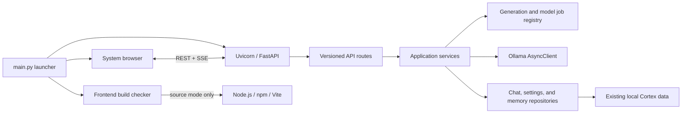
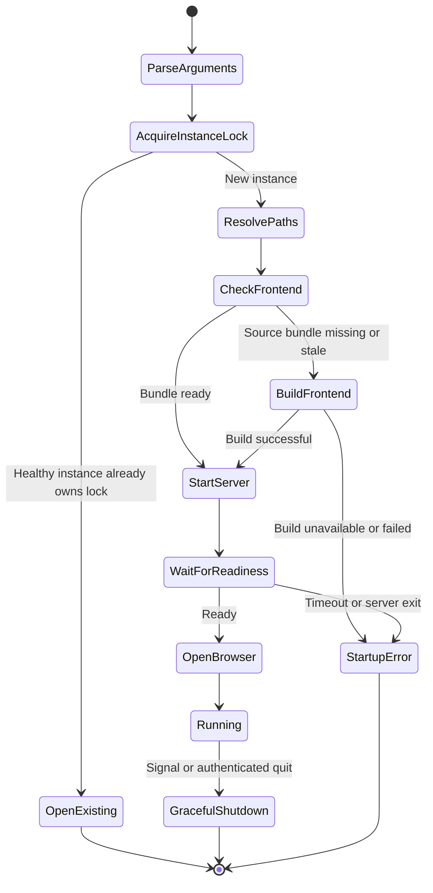

# Cortex Web Modernization and Qt Retirement Plan

| Field | Value |
| --- | --- |
| Status | Proposed implementation baseline |
| Planning stage | Web Stage 0 |
| Repository | `dovvnloading/Cortex` |
| Baseline branch | `main` |
| Baseline commit | `90cd8d3` |
| Primary platform | Windows desktop |
| Last reviewed | 2026-07-19 |

## 1. Purpose

This document is the governing implementation plan for replacing the Cortex
PySide6/Qt user interface with a modern local web application while preserving
the Python model and persistence capabilities that already work.

The target product is:

- A React and TypeScript frontend built with Vite.
- A local FastAPI backend implemented in Python.
- A single root `main.py` launcher that owns startup, frontend preparation,
  backend readiness, browser launch, process supervision, and shutdown.
- A packaged Windows application that contains the compiled frontend and does
  not require Node.js on an end-user machine.
- A local-first application that continues to use the user's existing chats,
  permanent memories, and settings.

This is intentionally a staged replacement. No implementation stage may remove
the working Qt path until the web path has passed the parity, migration,
security, and packaging gates defined here.

## 2. Document authority and change control

This document defines the default scope, sequencing, and acceptance gates for
the modernization program.

Changes to any of the following require an explicit architecture decision in
the pull request that changes this document:

- The local browser application model.
- The Python backend boundary.
- The persistence compatibility guarantees.
- The REST and Server-Sent Events transport split.
- The single-process production launcher model.
- The requirement that release builds do not depend on Node.js.
- The stage ordering or a stage exit gate.
- The local security model.

An implementation PR may refine internal names or file placement without an
architecture decision when it preserves the behavior and boundaries described
here. If implementation proves a planned boundary invalid, stop at the current
stage and update this document in a small follow-up PR before expanding scope.

## 3. Executive decision summary

The modernization will use these decisions:

1. Cortex will become a local web application opened in the user's system
   browser. It will not embed Chromium or introduce Electron, Tauri, or another
   desktop UI toolkit.
2. React, strict TypeScript, TSX, and Vite will implement the frontend.
3. FastAPI, Pydantic, and Uvicorn will implement the local Python API.
4. REST will handle commands and CRUD. Server-Sent Events (SSE) will carry
   generation deltas, reasoning deltas, progress, and terminal job events.
5. Backend Pydantic models and OpenAPI will be the source of truth for the
   frontend contract. A generated TypeScript client will be committed and
   checked for drift in CI.
6. Existing `sqlite3` repositories and atomic JSON memory writes will be kept.
   An ORM, PostgreSQL, or a remote database will not be introduced.
7. The production path will run one Python/Uvicorn process and serve the Vite
   production bundle directly from FastAPI.
8. Node.js will be a source-development and release-build dependency only.
9. `python main.py` will be the normal source launch command. A packaged build
   will use the same launcher logic.
10. Windows remains the supported desktop target for this program. The new
    architecture may make future platform support easier, but cross-platform
    packaging is not part of this migration.

## 4. Goals

### 4.1 Product goals

- Preserve all currently supported Cortex workflows.
- Stream model output as it is generated.
- Make startup and connection state understandable when Ollama is unavailable.
- Provide responsive, accessible, keyboard-friendly UI behavior.
- Make first source launch and subsequent source launches predictable.
- Make release launch independent of Python source layout and Node.js.
- Keep user data local and avoid undisclosed outbound traffic.
- Make errors recoverable without corrupting or falsely displaying saved state.

### 4.2 Engineering goals

- Isolate domain logic from UI and transport concerns.
- Replace Qt signals and threads with typed async services and cancellation.
- Define one versioned API contract.
- Make every operation testable without a real browser or real Ollama process.
- Keep each PR independently reviewable and revertible.
- Keep generated code visibly separated from handwritten code.
- Preserve the existing SQLite and permanent-memory formats where practical.
- Produce actionable logs without recording prompts or raw model responses.

### 4.3 Delivery goals

- Merge one stage before branching the next stage.
- Use draft PRs until the stage's checks and review checklist pass.
- Squash-merge every stage into `main`.
- Synchronize the local clone with `origin/main` after every merge.
- Split a stage rather than broadening it when implementation exposes a larger
  architectural issue.

## 5. Non-goals

The following are not part of this modernization:

- A hosted Cortex service.
- User accounts, remote authentication, or cloud synchronization.
- PostgreSQL, Redis, message brokers, containers, or microservices.
- Electron, Tauri, an embedded browser, or a system tray implementation.
- A mobile application.
- Multi-user access over a LAN.
- Enabling dormant vector memory without a separately approved product design.
- Rewriting the Ollama prompt system merely because the UI is changing.
- Moving user data to a new directory unless a concrete compatibility issue
  makes that unavoidable.
- Supporting multiple simultaneous interactive generations.
- Automatically installing or upgrading Python packages when Cortex launches.
- Automatically upgrading npm dependencies. Builds must use the committed lock
  file.

## 6. Safety invariants

These invariants apply to every stage:

1. Existing chats and permanent memories must remain readable.
2. No migration deletes its source data.
3. A schema migration creates a verified backup before writing.
4. A failed generation never creates a successful assistant message.
5. A retried request cannot duplicate a user message.
6. Only one interactive generation may be active globally.
7. A stale callback, event, or browser stream cannot mutate another chat.
8. Destructive memory and history operations require explicit confirmation.
9. The server binds to a loopback address unless a future, separately reviewed
   feature explicitly changes that behavior.
10. Browser-originated API access is authenticated for the current launcher
    session.
11. Logs must not contain full user prompts, permanent memories, or full model
    output.
12. The UI must still start when Ollama is down.
13. Release users must not need npm, Node.js, or PySide6.
14. The Qt fallback remains available until the web cutover stage passes.
15. No stage combines Qt removal with an unproven data migration.

## 7. Current-state inventory

### 7.1 Baseline

The plan was written against `main` at commit `90cd8d3` after the staged runtime,
persistence, boundary-safety, chat-correctness, and development-quality work.
At this baseline:

- The working tree is clean.
- The repository has 23 Python modules and approximately 6,800 Python lines in
  the application package.
- Seventeen application or setup files import PySide6.
- The test suite contains 21 passing tests.
- CI runs on Windows and executes pytest and Python compile checks.

The counts are descriptive, not acceptance metrics. They exist to show that Qt
is an application-level dependency rather than a replaceable view folder.

### 7.2 Qt coupling map

| Area | Current responsibility | Qt dependency | Migration seam |
| --- | --- | --- | --- |
| `Chat_LLM.py` | Entry point, settings, orchestration, workers, model checks, chat commands | `QApplication`, `QSettings`, `QThread`, signals, dialogs | Split configuration and services from the legacy adapter |
| `main_window.py` | Main stateful UI, job coordination, chat navigation, confirmations | Widgets, events, settings, animations | Replace with React feature modules and API calls |
| `query_worker.py` | Generation worker and one-job controller | `QObject`, `QThread`, `Signal` | Async `GenerationService` and job registry |
| `memory.py` | SQLite, permanent memory, in-memory history, app-data paths | `QStandardPaths` | Inject an `AppPaths` value object |
| `safe_rendering.py` | Qt-safe rendering | Qt/Qt HTML assumptions | Browser Markdown renderer with strict sanitization |
| `ui_*.py` | Dialogs, settings, chat elements, styles, actions | Qt widgets and signals | React components organized by feature |
| `splash_screen.py` | Timed startup presentation | Qt window and timers | Frontend startup screen driven by health state |
| `liability_agreement.py` | First-run acceptance | Qt dialog and QSettings | Onboarding route and backend-owned acceptance setting |
| `syntax_highlighter.py` | Code highlighting | Qt text document APIs | Browser syntax highlighter loaded on demand |
| `Cortex_Startup.py` | Ollama download links and model pulling | Standalone Qt app and worker | Model setup feature inside the web UI |

### 7.3 Existing reusable core

The following behavior should be extracted and evolved rather than discarded:

- Typed generation, connection, memory command, and translation results.
- Exact model-tag checks.
- One-active-generation behavior.
- Immutable generation snapshots.
- Stale-job rejection.
- SQLite per-operation connections and transaction handling.
- SQLite schema version checks and indexes.
- Transactional legacy JSON migration and quarantine.
- Atomic permanent-memory writes and validation.
- Structured memory-command parsing and confirmation requirements.
- Context-aware history and permanent-memory fitting.
- Safe failure behavior for generation and translation.
- Persisted message indices used by fork and regeneration.

### 7.4 Current persisted data

| Data | Current format | Compatibility policy |
| --- | --- | --- |
| Chat threads | SQLite `threads` table | Preserve and migrate in place through numbered schemas |
| Chat messages | SQLite `messages` table | Preserve IDs, order, sources, thoughts, and timestamps |
| Schema version | SQLite `PRAGMA user_version`, currently `1` | Increment only through tested migrations |
| Permanent memories | Validated JSON with atomic replacement and backup | Preserve file format during this program |
| Legacy chats | Per-chat JSON files | Preserve existing transactional migration behavior |
| User settings | Native `QSettings` for `ChatLLM` / `ChatLLM-Assistant` | Import once without deleting the legacy source |

### 7.5 Current settings requiring migration

| Legacy key | Target field | Type | Default |
| --- | --- | --- | --- |
| `theme` | `appearance.theme` | `light \| dark \| system` | `light` for migrated users; `system` for new users after product approval |
| `agreement_accepted` | `onboarding.agreement_accepted` | Boolean | `false` |
| `chat_model` | `models.chat` | String model tag | Current configured generation model |
| `temperature` | `generation.temperature` | Number | `0.7` |
| `num_ctx` | `generation.num_ctx` | Integer | `4096` |
| `seed` | `generation.seed` | Integer | `-1` |
| `memories_enabled` | `memory.enabled` | Boolean | `true` |
| `user_system_instructions` | `generation.system_instructions` | String | Empty |
| `translation_enabled` | `translation.enabled` | Boolean | `false` |
| `target_language` | `translation.target_language` | String | `Spanish` |
| `suggestions_enabled` | `suggestions.enabled` | Boolean | `true` |
| `suggestions_model` | `suggestions.model` | String model tag | Selected chat model |

Migration code must tolerate QSettings string-encoded booleans and numbers. A
bad individual setting falls back to its default and is reported; it must not
abort migration of all other settings.

### 7.6 Feature-parity inventory

The replacement must account for:

- Liability/onboarding acceptance.
- Light and dark themes.
- Startup and update status.
- Ollama connection and exact model presence.
- Model setup links and model pulling progress.
- New chats and first-message persistence.
- Loading, renaming, deleting, clearing, and forking chats.
- Sending one interactive generation at a time.
- Generation status, completion, error, retry, and cancellation.
- Assistant response, reasoning, sources, Markdown, code, and copy behavior.
- Regeneration with optional user instructions.
- Generated titles.
- Follow-up suggestions.
- Translation.
- Permanent-memory additions, editing, deduplication, and clearing.
- User system instructions and model behavior settings.
- Context-budget behavior.
- Clean shutdown during generation.

## 8. Target system architecture



### 8.1 Runtime boundaries

| Boundary | Owns | Must not own |
| --- | --- | --- |
| Launcher | Build checks, lock, ports, server process, browser, signals, exit | Chats, model prompts, UI state |
| API | Validation, authentication, HTTP semantics, error mapping | SQL, prompt construction, rendered UI |
| Services | Use cases, job state, generation snapshots, transactions | Browser components, FastAPI response objects |
| Repositories | Durable reads/writes and migrations | UI decisions or model inference |
| Ollama gateway | Ollama calls, streaming chunks, model operations, safe error mapping | Persistence or frontend events |
| Frontend | Rendering, navigation, user interaction, optimistic presentation | Authoritative persistence or job concurrency rules |

### 8.2 Target repository layout

```text
Cortex/
|-- main.py
|-- pyproject.toml
|-- backend/
|   `-- cortex_backend/
|       |-- app.py
|       |-- api/
|       |   |-- dependencies.py
|       |   |-- errors.py
|       |   |-- schemas.py
|       |   `-- routes/
|       |-- core/
|       |   |-- config.py
|       |   |-- paths.py
|       |   |-- security.py
|       |   `-- logging.py
|       |-- launcher/
|       |   |-- frontend.py
|       |   |-- instance_lock.py
|       |   `-- supervisor.py
|       |-- repositories/
|       |   |-- chats.py
|       |   |-- memories.py
|       |   `-- settings.py
|       `-- services/
|           |-- chat.py
|           |-- generation.py
|           |-- models.py
|           |-- ollama.py
|           `-- updates.py
|-- frontend/
|   |-- package.json
|   |-- package-lock.json
|   |-- vite.config.ts
|   |-- tsconfig.json
|   `-- src/
|       |-- api/
|       |-- app/
|       |-- components/
|       |-- features/
|       |-- hooks/
|       `-- styles/
|-- tests/
|   |-- backend/
|   |-- contract/
|   `-- fixtures/
|-- e2e/
`-- docs/
    `-- architecture/
```

The exact package subdirectories may be adjusted during extraction, but the
dependency direction must remain launcher/API -> services -> repositories and
gateways. Repositories and services must never import the frontend, FastAPI
route modules, or legacy Qt modules.

## 9. Architecture decisions

### 9.1 Local browser application

The browser is the UI runtime. This avoids bundling a second browser engine,
keeps deployment smaller, and lets Cortex use standard browser accessibility,
rendering, and developer tooling.

Consequences:

- The launcher remains alive while Cortex is running.
- Browser tabs are clients, not owners of durable application state.
- Closing a tab does not silently kill an active generation.
- The UI provides an authenticated Quit Cortex action.
- A second launch focuses or opens the already running instance.

### 9.2 React, TypeScript, and Vite

Use the official Vite React TypeScript template as the starting point. Enable
strict TypeScript and run a separate type-check command because Vite transpiles
TypeScript but does not provide full type checking during a build.

Use:

- React for components and composition.
- React Router for URL-addressable application views.
- TanStack Query for remote/server state.
- React hooks or small feature contexts for ephemeral UI state.
- Tailwind CSS for tokens and layout utilities.
- Accessible headless primitives only where browser-native elements are
  insufficient.

Do not add Redux or a general event bus initially. Introduce additional state
infrastructure only when a measured feature need cannot be expressed cleanly
with these tools.

### 9.3 FastAPI and Pydantic

Use an application factory so tests can inject temporary paths, a fake Ollama
gateway, deterministic clocks, and test configuration.

FastAPI lifespan owns:

- Repository schema verification.
- Legacy settings import checks.
- Ollama client creation.
- Job registry creation.
- Background connectivity monitoring when enabled.
- Cancellation and client cleanup during shutdown.

No network calls or data migrations may occur at Python module import time.

### 9.4 REST and SSE

REST is authoritative for state changes. SSE is authoritative for ordered
server-to-client progress.

SSE is selected instead of WebSockets because Cortex currently requires
unidirectional streaming for generation and model-pull progress. Cancellation,
retry, and other commands remain explicit REST operations. This keeps the
protocol inspectable and testable without maintaining a bidirectional socket
command protocol.

### 9.5 OpenAPI-generated frontend client

Pydantic request and response models define the REST contract. The generated
client is checked in so a frontend checkout can compile without a running
backend.

CI must:

1. Generate OpenAPI from the application factory with test configuration.
2. Regenerate the TypeScript client.
3. Fail when regeneration changes committed files.

SSE event models must also appear in OpenAPI components or a generated protocol
schema so event payload types are not duplicated by hand.

### 9.6 Persistence without an ORM

Keep the current short-lived `sqlite3` connection approach. The application is
single-user, local, and already has tested transaction behavior. An ORM would
increase migration surface without solving an active defect.

Introduce repositories around the existing implementation, then migrate the
database schema only as required for settings and idempotency.

### 9.7 Node is build-time only

Source mode may use Node.js to build a missing or stale frontend. Release mode
must always use a bundled, prebuilt `frontend/dist` directory.

The launcher must never run `npm update`. It may run `npm ci` only against the
committed lock file and only in a recognized source checkout.

## 10. Backend design

### 10.1 Service set

| Service | Responsibilities |
| --- | --- |
| `ChatService` | Chat lifecycle, message persistence, rename, delete, clear, fork, regenerate preparation |
| `GenerationService` | One-job policy, snapshots, generation lifecycle, cancellation, completion commit |
| `SuggestionService` | Optional follow-up generation scoped to a thread revision |
| `TitleService` | Title generation, normalization, stale-thread rejection |
| `MemoryService` | List, add, replace, clear-intent validation, model command application |
| `SettingsService` | Typed defaults, validation, revisions, legacy import |
| `ModelService` | Connectivity, exact tags, list, pull, optional-model requirements |
| `UpdateService` | Explicit update checks and redacted result state |

Services return domain results or raise typed domain errors. They do not return
FastAPI `Response` objects or HTTP status codes.

### 10.2 Job registry

The in-memory job registry owns interactive generation and model-pull jobs for
the lifetime of the local server.

Each job has:

- A UUID job ID.
- A client request ID for idempotency.
- A job type.
- A state: `queued`, `running`, `succeeded`, `failed`, or `cancelled`.
- Creation, start, and terminal timestamps.
- An immutable settings/model snapshot.
- A monotonically increasing event sequence.
- A bounded event replay buffer.
- A cancellation event.
- A terminal result or safe error.

Rules:

- At most one interactive generation is `queued` or `running`.
- A duplicate client request ID returns the original job rather than committing
  a second user message.
- Terminal event buffers remain available for a short documented period so the
  browser can reconnect and reconcile state.
- A disconnected browser does not automatically cancel a generation.
- Explicit cancellation is idempotent.
- Shutdown requests cancellation, waits for a bounded grace period, and marks
  any unfinished jobs cancelled before process exit.

### 10.3 Generation transaction boundary

The safe sequence is:

1. Validate the request and active chat revision.
2. Reject the request if an interactive job already exists.
3. Begin a database transaction.
4. Create the chat if this is its first message.
5. Persist the user message with the client request ID.
6. Create the job record.
7. Commit.
8. Build an immutable generation snapshot.
9. Stream Ollama output into the job event buffer.
10. Apply optional translation.
11. Validate any memory command.
12. Persist the assistant response in a transaction.
13. Publish the terminal success event with the persisted message ID.
14. Start title and suggestion follow-ups scoped to the resulting chat revision.

On generation or translation failure, no assistant message is committed. The
persisted user message remains visible with a retry action.

Regeneration is safer than a delete-then-generate sequence. The backend validates
that the target is the intended persisted assistant message and builds the new
job from the history immediately before it. The original assistant message stays
durable while generation is running. Only after a replacement succeeds does one
transaction remove the target response and commit the replacement. If the job
fails or is cancelled, the original response remains unchanged. Supporting
regeneration of a non-terminal branch would require an explicit truncation model
and is outside the initial parity scope.

### 10.4 Blocking work

Prefer the Ollama asynchronous client for network operations. Existing blocking
database and file operations remain small and isolated. When a blocking
operation could materially delay the event loop, run it through a bounded
worker thread with `asyncio.to_thread`.

Do not create an unbounded executor or one thread per event chunk.

## 11. API contract

All application endpoints live under `/api/v1`. Health endpoints may also have
stable aliases for launcher use.

### 11.1 Response and error conventions

Successful responses use typed resource models. Errors use one envelope:

```json
{
  "error": {
    "code": "generation_busy",
    "message": "A response is already being generated.",
    "request_id": "c1bf...",
    "retryable": true,
    "details": null
  }
}
```

Rules:

- `message` is safe for display.
- `details` never contains a prompt, memory list, or raw model output.
- Validation failures include safe field-level information.
- Every request receives a request ID.
- Expected conflicts use stable error codes, not exception class names.

### 11.2 Endpoint inventory

| Method | Path | Purpose |
| --- | --- | --- |
| `GET` | `/api/v1/health/live` | Process liveness |
| `GET` | `/api/v1/health/ready` | API, paths, and schema readiness |
| `GET` | `/api/v1/system/status` | Version, mode, data status, Ollama status, active jobs |
| `POST` | `/api/v1/session/launch-token` | Launcher-only handoff for an additional browser tab |
| `POST` | `/api/v1/session/exchange` | Exchange one-time launcher token for session cookie |
| `POST` | `/api/v1/system/shutdown` | Authenticated graceful shutdown request |
| `GET` | `/api/v1/chats` | Paginated chat summaries |
| `GET` | `/api/v1/chats/{thread_id}` | Chat and ordered messages |
| `PATCH` | `/api/v1/chats/{thread_id}` | Rename a chat with revision check |
| `DELETE` | `/api/v1/chats/{thread_id}` | Delete a confirmed chat |
| `POST` | `/api/v1/chats/{thread_id}/forks` | Fork through a persisted message ID |
| `POST` | `/api/v1/chats/clear-intents` | Create short-lived clear-history confirmation intent |
| `DELETE` | `/api/v1/chats` | Clear history with confirmation intent |
| `POST` | `/api/v1/generations` | Persist user input and create a generation job |
| `GET` | `/api/v1/generations/{job_id}` | Reconcile current job state |
| `GET` | `/api/v1/generations/{job_id}/events` | SSE progress and output stream |
| `POST` | `/api/v1/generations/{job_id}/cancel` | Idempotent cancellation |
| `POST` | `/api/v1/chats/{thread_id}/regenerations` | Remove only the selected response and create a replacement job |
| `GET` | `/api/v1/settings` | Typed settings and revision |
| `PUT` | `/api/v1/settings` | Validate and replace settings with revision check |
| `PATCH` | `/api/v1/settings` | Validate a partial settings update |
| `GET` | `/api/v1/memories` | Permanent memories and revision |
| `PUT` | `/api/v1/memories` | Validated replacement with revision check |
| `POST` | `/api/v1/memories/clear-intents` | Create short-lived clear confirmation intent |
| `DELETE` | `/api/v1/memories` | Clear using confirmation intent |
| `GET` | `/api/v1/models` | Installed, configured, and missing exact tags |
| `POST` | `/api/v1/model-pulls` | Create a model-pull job |
| `GET` | `/api/v1/model-pulls/{job_id}/events` | SSE pull progress |
| `POST` | `/api/v1/model-pulls/{job_id}/cancel` | Cancel when supported safely |
| `POST` | `/api/v1/updates/check` | Explicit update check |

The endpoint names are the planned contract. Any material change must update
this document before the frontend depends on it.

A new chat is not inserted merely because the user opened `/chat/new`. The first
generation request may omit `thread_id`; the backend then allocates the thread
ID and persists the thread and first user message in the same transaction. This
preserves the current no-empty-chat behavior while making persistence
authoritative on the backend.

### 11.3 Generation event protocol

All events contain:

```json
{
  "event_id": 12,
  "event": "generation.content_delta",
  "job_id": "8b35...",
  "thread_id": "2aa1...",
  "timestamp": "2026-07-19T22:30:00Z",
  "data": {}
}
```

Planned event variants:

| Event | Required data |
| --- | --- |
| `generation.queued` | Queue position, normally zero |
| `generation.started` | Model tag and safe phase |
| `generation.status` | Stable phase code and user-facing text |
| `generation.thinking_delta` | Text delta |
| `generation.content_delta` | Text delta |
| `generation.translation_started` | Target language |
| `generation.persisting` | No content |
| `generation.completed` | Assistant message ID, chat revision, title state |
| `generation.failed` | Safe error envelope |
| `generation.cancelled` | Cancellation reason |

The frontend accumulates deltas for presentation. The terminal persisted chat
resource remains authoritative. After completion or reconnect, the frontend
refetches the chat and replaces accumulated temporary content with persisted
content.

### 11.4 Reconnection

- Events use monotonically increasing IDs.
- The client sends `Last-Event-ID` when reconnecting.
- The server replays retained events after that ID.
- If replay has expired, the server returns a stable replay-expired response and
  the frontend reconciles through the job and chat resources.
- Duplicate event IDs are ignored by the frontend.
- Events for a non-active thread may update cache but must not replace the
  visible active thread.

## 12. Frontend design

### 12.1 Application routes

| Route | View |
| --- | --- |
| `/` | Redirect to the active/new chat |
| `/chat/new` | Unpersisted new-chat composition state |
| `/chat/:threadId` | Persisted chat |
| `/settings/general` | Appearance and application behavior |
| `/settings/models` | Ollama, model selection, and model pulls |
| `/settings/generation` | Temperature, context, seed, instructions |
| `/settings/memory` | Memory enablement and permanent memories |
| `/settings/translation` | Translation controls |
| `/settings/system` | Version, update, diagnostics, migration status, quit |
| `/onboarding` | Liability agreement and first-run setup |

### 12.2 Feature modules

Each feature owns its components, hooks, tests, and view-specific models:

- `chat`: transcript, composer, streamed response, reasoning, sources,
  regeneration, forks, suggestions.
- `history`: summary list, pagination, rename, delete, clear.
- `models`: connectivity, required tags, installed models, pull jobs.
- `settings`: typed forms and validation feedback.
- `memory`: memo editing, deduplication, clear confirmation.
- `onboarding`: agreement and Ollama setup.
- `system`: updates, diagnostics, migration report, shutdown.

Shared components remain presentation-only. They must not directly call API
endpoints.

### 12.3 State ownership

| State | Owner |
| --- | --- |
| Chats, settings, memories, jobs, models | Backend and TanStack Query cache |
| Current route/thread | URL/router |
| Composer draft | Feature-local state, optionally session storage |
| Theme before settings load | Small bootstrap script using last safe local preference |
| Modal/dropdown/open state | Component-local state |
| Accumulated SSE deltas | Generation feature state keyed by job ID |
| Notifications | Small application-level notification provider |

Do not place complete chat transcripts or settings copies into a second global
store. The query cache and persisted backend resources are authoritative.

### 12.4 Rendering safety

- User messages render as text, never as HTML.
- Assistant Markdown uses `react-markdown` with raw HTML disabled.
- `rehype-sanitize` applies an explicit allowlist after any transform plugin.
- Images are disabled initially. Adding remote images requires a separate
  privacy and content-policy review.
- Links allow only `http` and `https` initially.
- External links open with `noopener,noreferrer` through a controlled handler.
- Code fences render text and use syntax highlighting without executing code.
- Copy buttons use the Clipboard API only after a user action.
- Reasoning and sources use the same rendering restrictions as responses.
- No model content is passed to `dangerouslySetInnerHTML`.

### 12.5 Accessibility and interaction

- Use semantic landmarks and native controls whenever possible.
- Every control has an accessible name.
- Dialogs trap and restore focus.
- All menus, settings, chat selection, and send/cancel actions work by keyboard.
- Status changes use appropriately scoped live regions without announcing every
  streamed token.
- Color is not the only indication of connection, error, or selected state.
- Respect `prefers-reduced-motion`.
- Preserve readable contrast in both themes.
- Composer shortcuts are documented and do not interfere with text editing.

## 13. Launcher and runtime specification

### 13.1 Supported commands

| Command | Behavior |
| --- | --- |
| `python main.py` | Production-like source launch; build frontend only when needed |
| `python main.py --dev` | Start backend and supervised Vite HMR server |
| `python main.py --no-browser` | Start without opening a browser; intended for tests and diagnostics |
| `python main.py --port 0` | Request an OS-selected free backend port |
| `python main.py --build-frontend` | Perform deterministic frontend build and exit |
| `python main.py --skip-build-check` | Deliberately use the current bundle |
| `python main.py --log-level LEVEL` | Override configured log level |
| `python main.py --data-dir PATH` | Use an explicit isolated profile in source/test mode |

During the cutover PR only, `--legacy-qt` may be provided as a temporary
fallback. It is removed in the Qt-removal stage.

An explicit data directory must display a clear non-production-profile banner.
Automated, migration, destructive-action, and E2E tests always use temporary
injected profiles; they must never run against the default user profile.

### 13.2 Normal launch state machine



### 13.3 Frontend build detection

Source mode stores a build manifest containing at least:

- The SHA-256 of `package-lock.json`.
- A deterministic digest of tracked frontend source files and build config.
- The Node and npm major versions used.
- The Vite build timestamp and Cortex version.

Rebuild when:

- `frontend/dist/index.html` is absent.
- The manifest is absent or invalid.
- The lockfile digest differs.
- The frontend source/config digest differs.
- The launcher explicitly requests a build.

Run `npm ci` when `node_modules` is absent or the lockfile digest used to create
it differs. Do not run `npm ci` on every launch.

Build output must be written to a temporary directory and moved into place only
after a successful build so a failed build does not destroy the last known-good
bundle.

### 13.4 Development supervision

In `--dev` mode, the launcher owns the Vite child process and the backend server.
It must:

- Select non-conflicting ports before spawning children.
- Pass the backend origin to Vite explicitly.
- Wait for both health endpoints.
- Open the Vite URL only after both are ready.
- Stream prefixed child logs without exposing secrets.
- Forward Ctrl+C and termination.
- Terminate the complete Windows child-process tree on shutdown.
- Return a non-zero exit code when either required process exits unexpectedly.

### 13.5 Readiness

`/health/live` means the server event loop can answer.

`/health/ready` means:

- Application paths resolved.
- The database schema is supported and migration is complete.
- Permanent-memory data is readable or safely recovered.
- Settings are readable.
- Routes and frontend assets are available for the selected mode.

Ollama availability is not part of backend readiness. It is reported separately
so the application can open and guide the user when Ollama is unavailable.

### 13.6 Single-instance behavior

The launcher maintains a per-user instance record containing the process ID,
port, creation time, and a non-secret instance identifier. A separate handoff
secret is stored in a current-user-only local file, is never served as a static
asset, and is never logged.

On launch:

1. Attempt to acquire the per-user lock.
2. If held, validate the recorded process and health endpoint.
3. Read the launcher handoff secret and use it to ask the existing instance for
   a fresh, short-lived browser-launch token through a dedicated loopback
   endpoint.
4. Open that URL and exit.
5. If the record is stale, recover it only after proving the process is absent or
   not the Cortex process that owns the record.

Never terminate an arbitrary process based only on a stale PID file.

### 13.7 Shutdown

Shutdown can begin through Ctrl+C, OS process termination, server failure, or an
authenticated UI request.

The sequence is:

1. Stop accepting mutating API requests.
2. Publish shutdown status to connected clients when possible.
3. Request cancellation of active jobs.
4. Wait for the bounded job grace period.
5. Close Ollama HTTP clients.
6. Complete or roll back active persistence operations.
7. Stop Vite in development mode.
8. Stop Uvicorn.
9. Remove the instance record and temporary session material.
10. Exit with a meaningful code.

Browser tab closure alone does not shut down Cortex.

## 14. Data and settings migration

### 14.1 Path strategy

The first web release continues using the existing Cortex data location. It does
not move chat or memory files merely to adopt a new package layout.

Before removing PySide:

1. Add a diagnostic test/helper that records the actual legacy
   `QStandardPaths.AppDataLocation` for `ChatLLM` / `ChatLLM-Assistant` on
   Windows.
2. Record expected database, legacy chat, permanent-memory, and backup paths.
3. Implement `AppPaths` with injected test roots and a Windows production root.
4. Compare `AppPaths` with the legacy Qt result in a Windows integration test.

If multiple historical locations exist, select the location containing the
newest valid Cortex database and report all discovered candidates. Never merge
two databases automatically.

### 14.2 Database migration

The likely next schema adds:

- A typed settings table.
- A migration ledger.
- A client request ID or equivalent idempotency field for user-message commits.
- Optional revision metadata required by concurrent browser tabs.

Before applying any schema migration:

1. Verify the current schema version is supported.
2. Use SQLite's backup mechanism to create a timestamped backup.
3. Validate the backup can be opened and has expected integrity.
4. Apply the migration in one transaction where SQLite permits.
5. Run `PRAGMA integrity_check` or a focused equivalent.
6. Advance `PRAGMA user_version` only after successful validation.
7. Retain a bounded number of verified backups without deleting the newest good
   pre-migration backup.

If migration fails, close the attempted connection, keep the original and
backup, and start Cortex in a diagnostic error state without presenting a blank
new database as success.

### 14.3 QSettings import

The migration must work for users upgrading directly from a Qt release to the
final web release.

Implementation sequence:

1. During the transitional stage, capture values through QSettings and through a
   native Windows reader.
2. Verify both readers agree for every known key and type fixture.
3. Use the native reader in the Qt-free release.
4. Validate each value independently through the target Pydantic settings model.
5. Import only when the target field has not already been explicitly set.
6. Record source, timestamp, imported fields, skipped fields, and invalid fields
   in the migration ledger.
7. Leave the legacy registry/settings data untouched.

The migration is idempotent. Re-running it cannot replace a newer web setting.

### 14.4 Permanent memory

Keep the current validated JSON format and atomic replacement behavior during
the UI migration. The backend memory repository exposes revision-aware list and
replace operations, but delegates durable writes to the existing safe manager
until that code is cleanly extracted.

### 14.5 Rollback data guarantee

Until Qt removal, a user must be able to launch the legacy UI against the same
chat and memory data after rolling back an application build. Therefore:

- Do not rewrite existing message content.
- Add columns or tables in a backward-tolerant way where possible.
- Test the legacy reader against a copy of the upgraded fixture.
- Document the first schema version that cannot be read by the legacy release if
  such a change becomes necessary.

## 15. Local security and privacy model

### 15.1 Network exposure

- Bind to `127.0.0.1` by default.
- Do not bind to `0.0.0.0` through a normal UI setting.
- Reject unexpected `Host` and `Origin` values.
- In development, allow only the exact supervised Vite origin.
- Do not use wildcard CORS with credentials.
- Do not expose API documentation in packaged release mode unless a diagnostic
  flag enables it.

### 15.2 Launcher session authentication

Loopback alone is insufficient because an unrelated web page can attempt to
contact local services.

Planned exchange:

1. The launcher generates a high-entropy, one-time token with a short expiry.
2. It opens Cortex with the token in the URL fragment, which is not sent in the
   initial HTTP request.
3. The frontend reads the fragment and exchanges it through a same-origin POST.
4. The backend invalidates the one-time token and sets an HttpOnly, SameSite
   session cookie for the current launcher lifetime.
5. The frontend removes the token fragment from browser history immediately.
6. Mutating requests, SSE subscriptions, and shutdown require the session.

The token and cookie are never logged. A browser refresh within the same
launcher session remains authenticated.

### 15.3 Browser headers

Production responses should set a restrictive policy including:

- A Content Security Policy using only bundled scripts, styles, fonts, and
  images.
- `X-Content-Type-Options: nosniff`.
- A restrictive referrer policy.
- Frame denial or an equivalent CSP `frame-ancestors` policy.
- No caching for session exchange and sensitive API responses.

Do not load fonts, analytics, scripts, or UI assets from a CDN.

### 15.4 Outbound requests

Expected outbound destinations must be visible and documented:

- The configured Ollama host.
- The explicit official Ollama download links opened by the user.
- The configured update endpoint when update checks are enabled.

The recommended privacy default for new installations is a user-visible update
check setting. Migration should preserve the effective legacy behavior until a
separate product decision changes it.

### 15.5 Destructive actions

The frontend confirmation dialog is necessary but not sufficient for large
destructive operations. Clearing all chats or all memories requires a
short-lived backend confirmation intent tied to the current session and action.

Confirmation intents:

- Expire quickly.
- Are single-use.
- Name the action and affected resource scope.
- Cannot be exchanged between history and memory operations.

### 15.6 Logging

Allowed diagnostic data:

- Request and job IDs.
- Operation names and durations.
- Model tags.
- Counts and sizes.
- Safe error codes and exception class names.
- Migration counts and file identifiers that do not contain user content.

Forbidden diagnostic data:

- Full prompts or queries.
- Full model responses or reasoning.
- Permanent-memory text.
- Session tokens or cookies.
- Arbitrary request bodies.
- Raw legacy chat file contents.

## 16. Observability and diagnostics

### 16.1 Logging outputs

- Console logs in source and development modes.
- Rotating UTF-8 file logs in the Cortex data directory.
- Stable phase names for launcher, migration, Ollama, and job events.
- One startup summary containing mode, version, paths status, frontend build ID,
  and safe connectivity status.

### 16.2 Diagnostic report

The system settings view may export a redacted report containing:

- Cortex and Python versions.
- Operating system version.
- Frontend build ID.
- Database schema version and integrity result.
- Settings migration status.
- Ollama reachability and installed model tags.
- Recent safe error codes.
- Relevant path names, with the Windows user profile portion redacted.

It must not contain conversations, memories, prompts, responses, or tokens.

## 17. Testing strategy

### 17.1 Test layers

| Layer | Tools | Scope |
| --- | --- | --- |
| Domain unit | pytest | Snapshots, context budgeting, commands, titles, state transitions |
| Repository | pytest + temporary SQLite/files | Transactions, migrations, compatibility, rollback |
| API integration | FastAPI TestClient/httpx | Validation, auth, errors, CRUD, idempotency |
| Streaming | pytest/TestClient | SSE ordering, replay, disconnect, cancel, terminal events |
| Frontend unit | Vitest | Utilities, reducers, event accumulation, validation |
| Frontend component | React Testing Library | User behavior, forms, dialogs, accessibility, errors |
| Contract | OpenAPI/client regeneration | Python/TypeScript drift |
| End-to-end | Playwright | Browser workflows against a real local backend |
| Packaging smoke | Windows runner/clean VM | Bundled assets, launch, browser, shutdown, no Node |

### 17.2 Fake Ollama server

CI must not require a downloaded model. Build a deterministic fake Ollama HTTP
server supporting the subset Cortex uses:

- Version/health response.
- Model list with exact tags.
- Chat streaming with configurable content and thinking chunks.
- Translation/title/suggestion responses.
- Model pull progress.
- Delays, disconnections, malformed chunks, missing models, and error status.
- Cancellation observation.

Tests inject the fake endpoint through configuration. A separate optional manual
smoke run uses real Ollama.

### 17.3 Required backend scenarios

- Startup with valid, missing, corrupt, newer, and migratable databases.
- QSettings import with valid, malformed, partial, and repeated values.
- One-generation enforcement under simultaneous requests.
- Duplicate client request idempotency.
- Stream disconnect and replay.
- Cancellation before start, during generation, during translation, and during
  persistence.
- Browser restart/reconciliation after terminal completion.
- Failed generation does not persist an assistant response.
- Fork and regeneration use persisted message IDs.
- Stale title and suggestion results are ignored.
- Clear intents expire and cannot be reused.
- Ollama unavailable does not make app readiness fail.

### 17.4 Required frontend scenarios

- Empty, loading, connected, unavailable, busy, streaming, failed, and cancelled
  states.
- Rapid route changes during a stream.
- Duplicate and out-of-order SSE events.
- Safe rendering of HTML, scripts, images, dangerous links, and malformed
  Markdown.
- Keyboard-only navigation and dialog completion.
- Screen-reader names and status announcements.
- Long chat rendering and scroll retention.
- Theme startup without a flash of the wrong theme.
- Settings revision conflict and retry.
- Confirmation behavior for destructive actions.

### 17.5 End-to-end parity flow

The final E2E suite covers:

1. First launch and agreement.
2. Ollama-unavailable setup guidance.
3. Connection recovery.
4. Model selection.
5. New chat and streamed generation.
6. Reasoning, Markdown, code copy, and safe links.
7. Generated title and suggestions.
8. Translation.
9. Memory add, edit, deduplication, and confirmed clear.
10. Regeneration.
11. Forking from a persisted message.
12. Rename and delete.
13. Existing-data migration.
14. Reload and job reconciliation.
15. Shutdown during generation.
16. Second-instance behavior.

### 17.6 Performance and regression budgets

Establish measured baselines before setting hard numerical gates. At minimum,
record:

- Warm release startup to API readiness.
- Readiness to first rendered application shell.
- Initial compressed JavaScript and CSS sizes.
- Rendering and scrolling with 100, 500, and 1,000 messages.
- Memory usage before and after repeated chat navigation.
- SSE throughput and UI update cadence.

After baselines are accepted, a PR must explain regressions greater than 10% in
startup, bundle size, long-chat interaction time, or steady-state memory.

Streamed deltas should be batched to animation frames or short intervals rather
than causing a React render for every tiny Ollama chunk.

### 17.7 Manual Windows smoke checklists

Manual checks use an isolated profile created for the stage. Destructive tests
must not use a maintainer's default Cortex profile.

Core extraction smoke:

- Launch the Qt application through its documented entry point.
- Confirm the existing-data fixture appears with titles and ordered messages.
- Change one setting and verify restart persistence.
- Generate, cancel, regenerate, fork, rename, and delete a fixture chat.
- Close during generation and confirm the process exits.

Web preview smoke:

- Launch with the preview or development command.
- Confirm startup shell behavior with Ollama stopped.
- Start Ollama and retry without restarting Cortex.
- Exercise the full feature-parity inventory.
- Refresh during generation and reconcile the job.
- Open a second tab and verify authoritative job/chat state.
- Attempt unsafe Markdown and link fixtures.
- Quit Cortex and confirm no owned process remains.

Packaged release smoke:

- Use a clean Windows environment without Node.js or a global Python install.
- Upgrade a copy of a representative legacy profile.
- Verify backup and migration report creation.
- Run the complete E2E parity flow manually with real Ollama.
- Launch Cortex twice and verify single-instance behavior.
- Restart Windows with no active job and confirm no invalid stale lock remains.
- Simulate an occupied preferred port.
- Verify uninstall does not delete user data unless explicitly selected and
  confirmed by the user.

## 18. CI and dependency policy

### 18.1 CI jobs

1. **Backend**: install Python dependencies, pytest, compile/import checks.
2. **Frontend**: `npm ci`, typecheck, lint, component tests, production build.
3. **Contract**: regenerate OpenAPI and TypeScript client; require clean diff.
4. **E2E**: launch the backend with fake Ollama and run Playwright Chromium.
5. **Package**: build the Windows artifact and run a no-Node smoke test when the
   launcher stage begins.

Keep jobs separate so failures identify the responsible boundary.

### 18.2 Dependency rules

- Commit `package-lock.json`.
- Use Node 24 LTS for the initial implementation baseline.
- Pin Vite's current minor range because its TypeScript definitions may change
  in minor releases.
- Use bounded Python dependency ranges in `pyproject.toml`.
- Review lockfile changes as code changes.
- Do not merge automated major-version upgrades without a focused compatibility
  PR.
- Keep frontend dependencies small and purpose-specific.
- Remove PySide6 only in the final removal stage, not during extraction.

### 18.3 Standard checks

```powershell
python -m pytest
python -m compileall -q backend
npm --prefix frontend ci
npm --prefix frontend run typecheck
npm --prefix frontend run lint
npm --prefix frontend run test -- --run
npm --prefix frontend run build
```

Playwright and package checks are added when their stages introduce them.

## 19. Packaging and release

### 19.1 Packaging model

The initial target is a PyInstaller one-folder Windows build containing:

- The Python runtime and backend dependencies.
- Prompt and icon assets.
- The compiled `frontend/dist` bundle.
- Launcher metadata and version information.

One-folder packaging is preferred initially because static asset inspection,
startup, and failure diagnosis are more predictable than temporary extraction
from a one-file executable. A one-file build can be evaluated later using
measured startup and antivirus behavior.

### 19.2 Release guarantees

On a clean supported Windows installation:

- Cortex launches without Node.js.
- Cortex launches without a global Python installation when using the packaged
  artifact.
- The frontend bundle matches the backend API version.
- Existing user data is detected.
- Ollama absence produces setup guidance rather than a crash.
- A second launch opens the existing instance.
- Quit removes all Cortex-owned processes.

### 19.3 Version compatibility

Expose these versions in `/api/v1/system/status`:

- Cortex application version.
- API major version.
- Frontend build ID and expected API major.
- Database schema version.

The frontend refuses mutating operations and displays a reload/reinstall error
when its expected API major differs from the backend.

## 20. Staged delivery plan

Every stage starts from freshly synchronized `main` and follows:

1. Create the named branch.
2. Implement only the stage scope.
3. Run stage checks.
4. Review `git diff` and generated files.
5. Commit using Conventional Commits.
6. Push the branch.
7. Open a draft PR against `main`.
8. Review checks and the stage exit checklist.
9. Mark ready.
10. Squash-merge.
11. Synchronize local `main` with `origin/main`.
12. Begin the next stage only after synchronization.

### 20.1 Web Stage 0 - Architecture plan

Branch: `agent/web-00-modernization-plan`

PR title: `docs(architecture): define the web modernization plan`

Scope:

- Add this governing architecture and migration plan.
- Link it from the README.
- Make no runtime changes.

Exit criteria:

- Current-state inventory agrees with the code at the baseline commit.
- Target decisions, non-goals, invariants, risks, and stage gates are explicit.
- The document renders correctly on GitHub.
- The existing test suite remains unchanged and passing.

Rollback: revert the documentation PR; runtime is unaffected.

### 20.2 Web Stage 1 - Core extraction

Branch: `agent/web-01-core-extraction`

PR title: `refactor(core): decouple application services from Qt`

Entry criteria:

- Web Stage 0 is merged.
- The current Qt smoke checklist passes.
- Representative existing-data fixtures are captured.

Scope:

- Create the backend package skeleton.
- Introduce `AppPaths` and compare it with QStandardPaths on Windows.
- Introduce typed settings models and repository interfaces.
- Split the orchestrator into Qt-independent services.
- Replace core callbacks/signals with typed progress interfaces.
- Keep Qt adapters and the Qt default launch path working.
- Add import-boundary tests.

Out of scope:

- FastAPI routes.
- React files.
- Changing the default UI.
- Removing PySide6.

Required validation:

- Existing tests.
- New service and path tests.
- Qt startup smoke.
- Existing chat, memory, and settings fixture compatibility.
- No PySide imports in the new service/repository packages.

Exit criteria:

- Core services can be instantiated in a headless pytest process.
- The Qt UI runs through adapters without behavior regression.
- Data locations are explicitly tested.

Rollback: revert the extraction PR; no irreversible migration is permitted.

### 20.3 Web Stage 2 - API and job protocol

Branch: `agent/web-02-fastapi-contract`

PR title: `feat(api): add the local Cortex backend contract`

Entry criteria:

- Stage 1 services are merged and headless.
- Service methods have typed input/output boundaries.

Scope:

- Add FastAPI application factory and lifespan.
- Add local session exchange and request security.
- Add API v1 resources for system, chats, settings, memories, and models.
- Add generation and model job registries.
- Add typed SSE generation and model-pull streams.
- Add a deterministic fake Ollama server.
- Generate and commit OpenAPI artifacts and initial TypeScript client types.
- Expose the API through an opt-in preview command; Qt remains default.

Out of scope:

- Production React UI.
- Default launcher cutover.
- Qt deletion.

Required validation:

- API integration and security tests.
- SSE ordering/replay/cancel tests.
- Idempotency and persistence rollback tests.
- Ollama unavailable and malformed stream tests.
- Contract regeneration clean-diff check.

Exit criteria:

- Every planned frontend use case has an API operation or documented reason to
  wait for a later stage.
- API behavior is testable without Qt or real Ollama.

Rollback: disable/remove the preview API path; Qt remains functional.

### 20.4 Web Stage 3 - React shell

Branch: `agent/web-03-react-shell`

PR title: `feat(web): add the Cortex React application shell`

Entry criteria:

- API contract and generated client are merged.
- Node 24 LTS is documented for developers.

Scope:

- Scaffold Vite React TypeScript.
- Add strict type checking, linting, Vitest, and component test setup.
- Add application routing, design tokens, themes, error boundaries, toasts, and
  accessible primitives.
- Implement onboarding, sidebar/history, system status, and settings shell.
- Connect read and basic CRUD operations to the real API.
- Serve the production bundle from FastAPI in preview mode.

Out of scope:

- Full streamed chat parity.
- Model pulling.
- Default launcher cutover.

Required validation:

- Typecheck, lint, unit, component, and build checks.
- Keyboard/accessibility checks.
- API contract drift check.
- Manual responsive review.

Exit criteria:

- The web shell loads from the Python backend.
- Existing chats and settings can be viewed safely.
- The Qt path remains the normal user path.

Rollback: remove the preview web shell; API and Qt remain available.

### 20.5 Web Stage 4 - Chat parity

Branch: `agent/web-04-chat-parity`

PR title: `feat(chat): deliver streamed web chat parity`

Entry criteria:

- The shell and API contract are stable.
- Fake Ollama supports all generation states.

Scope:

- Chat composer and persisted chat routing.
- Streamed content and reasoning.
- Generation status, cancellation, retry, and reconnect reconciliation.
- Safe Markdown, code, copy, links, sources, and reasoning sections.
- Titles, suggestions, translation, regenerate, and fork.
- Long-chat scrolling and render batching.
- First Playwright parity flow.

Out of scope:

- Model setup replacement.
- Qt removal.
- Default cutover.

Required validation:

- Backend streaming tests.
- Frontend stream and sanitization tests.
- Playwright generation, retry, fork, and regenerate flows.
- Manual real-Ollama smoke.

Exit criteria:

- A user can complete core chat workflows in the preview web UI.
- Stale streams and route changes cannot corrupt visible state.
- Failed output is never represented as persisted success.

Rollback: return users to Qt; no data downgrade is required.

### 20.6 Web Stage 5 - System parity and migration

Branch: `agent/web-05-system-parity`

PR title: `feat(system): migrate settings and model management to web`

Entry criteria:

- Core chat parity is merged.
- Data backup fixtures are available.

Scope:

- Complete settings forms and validation.
- Complete permanent-memory management.
- Add confirmation intents.
- Integrate Ollama setup links, connectivity, installed models, and pull progress.
- Implement and verify native QSettings migration.
- Implement database settings schema migration and ledger.
- Add diagnostics and migration report.
- Add E2E tests for settings, memory, models, and existing data.

Out of scope:

- Removing the legacy source or dependency.
- Making web launch the default.

Required validation:

- Valid, malformed, partial, duplicate, and repeated settings migration.
- Database backup and rollback tests.
- Qt reader compatibility against upgraded fixtures.
- Memory and destructive action tests.
- Model pull progress/error tests.

Exit criteria:

- Every QSettings key has a tested mapping.
- Existing chats and memories are unchanged.
- `Cortex_Startup.py` capabilities are available in the preview web UI.

Rollback: use the verified database backup and Qt fallback. Legacy QSettings
source remains untouched.

### 20.7 Web Stage 6 - Launcher and default cutover

Branch: `agent/web-06-launcher-cutover`

PR title: `feat(launcher): make the web application the default Cortex runtime`

Entry criteria:

- Web feature and migration parity are merged.
- Final parity checklist has no blocking gaps.
- A package prototype has passed on a clean Windows test environment.

Scope:

- Add the root `main.py` launcher.
- Add source build fingerprinting and atomic frontend build replacement.
- Add development supervision.
- Add single-instance behavior.
- Add readiness waiting and authenticated browser launch.
- Add UI shutdown and complete process cleanup.
- Make the web UI default.
- Retain `--legacy-qt` for this stage only.
- Produce and smoke-test the Windows one-folder artifact.

Required validation:

- Clean source first launch.
- Warm source launch without build.
- Missing Node and failed build recovery.
- Occupied port and second-instance behavior.
- Ctrl+C, UI quit, server failure, and generation shutdown.
- Packaged no-Node launch.
- Full Playwright parity flow.

Exit criteria:

- `python main.py` is reliable in normal and development modes.
- The packaged artifact needs neither Node nor a global Python installation.
- No launcher-owned process remains after shutdown.
- The legacy fallback remains usable for one stage.

Rollback: launch `--legacy-qt` or revert the default entry point. User data stays
compatible.

### 20.8 Web Stage 7 - Qt removal and release candidate

Branch: `agent/web-07-remove-qt`

PR title: `refactor(ui): remove the legacy PySide application`

Entry criteria:

- The default web release candidate has passed the complete Windows smoke
  checklist.
- Existing-user upgrade and rollback procedures were exercised.
- No blocking parity gaps remain.
- The fallback has not been required to recover a release-blocking web defect.

Scope:

- Delete Qt windows, dialogs, widgets, styles, workers, safe-rendering adapter,
  splash, and setup utility.
- Remove PySide6 and Qt-only Markdown dependencies.
- Remove Visual Studio Python artifacts when no longer useful.
- Remove `--legacy-qt`.
- Update README, contributing, setup, security, changelog, and release docs.
- Produce the final release candidate.

Required validation:

- No runtime `PySide`, `PyQt`, or Qt import remains.
- Backend, frontend, contract, E2E, and package jobs pass.
- Existing data opens in the packaged application.
- Ollama-unavailable startup works.
- Full manual Windows checklist passes.

Exit criteria:

- All modernization completion criteria in this document pass.
- PySide6 is absent from runtime dependencies and the packaged artifact.
- The release documentation accurately describes the new architecture.

Rollback: distribute the previous Qt-capable release with the documented data
backup. Do not attempt an untested in-place downgrade.

## 21. Pull request gate checklist

Every implementation PR includes:

- [ ] Scope matches exactly one stage or an explicitly approved split.
- [ ] No unrelated user files are staged.
- [ ] Current `main` was synchronized before branch creation.
- [ ] Public contract changes are documented.
- [ ] Data migrations include backup, failure, and idempotency tests.
- [ ] New errors have stable safe error codes.
- [ ] Logs were reviewed for prompt/response leakage.
- [ ] Focused tests pass locally.
- [ ] CI passes.
- [ ] Generated files were reviewed separately.
- [ ] Manual stage smoke checklist passes.
- [ ] Rollback for the stage is still possible.
- [ ] README/changelog changes are included when user-visible behavior changes.
- [ ] The PR started as draft and was marked ready only after review.
- [ ] Squash merge is used.
- [ ] Local `main` is synchronized after merge before the next stage.

## 22. Feature parity matrix

| Capability | Qt baseline | API owner | Web owner | Required before cutover |
| --- | --- | --- | --- | --- |
| Agreement | QSettings/dialog | Settings/onboarding API | Onboarding route | Yes |
| Theme | QSettings/stylesheets | Settings API | Theme provider | Yes |
| Connection state | Worker/title bar | Model service | Status header/setup | Yes |
| Chat history | Main window/database manager | Chat service | Sidebar/router | Yes |
| New chat | In-memory active ID | Chat service | Chat route/composer | Yes |
| Generation | QThread worker | Generation service | SSE transcript | Yes |
| Cancellation | Thread interruption | Job cancellation | Stop action | Yes |
| Reasoning | Qt expandable section | Message schema/SSE | Expandable section | Yes |
| Markdown/code | Qt renderer/highlighter | Raw safe content | Sanitized browser renderer | Yes |
| Titles | Title worker | Title service | Cache update | Yes |
| Suggestions | Suggestion worker | Suggestion service | Suggestion chips | Yes |
| Translation | Orchestrator chain | Generation service | Status/result UI | Yes |
| Fork | Widget message index | Persisted message ID | Message action | Yes |
| Regenerate | UI/database coordination | Chat/generation services | Message action | Yes |
| Memories | Qt memory dialog | Memory service | Memory settings | Yes |
| System instructions | Qt dialog/QSettings | Settings service | Generation settings | Yes |
| Model behavior | Qt dialog/QSettings | Settings service | Generation settings | Yes |
| Model pulling | Standalone Qt utility | Model service/job | Model settings | Yes |
| Update check | Background worker | Update service | System settings | Yes |
| Shutdown | Window close event | Launcher/lifespan | Quit action | Yes |
| Vector memory | Dormant | None | None | No; remains disabled |

## 23. Risk register

| Risk | Likelihood | Impact | Mitigation | Trigger to stop stage |
| --- | --- | --- | --- | --- |
| Existing data path is misidentified after Qt removal | Medium | Critical | Compare AppPaths and QStandardPaths on Windows; fixture actual locations | Any mismatch without deterministic resolution |
| QSettings registry interpretation loses values | Medium | High | Dual-read comparison before PySide removal; leave source untouched | Readers disagree for known fixtures |
| Duplicate user messages after request retry | Medium | High | Client request IDs and unique idempotency storage | Retry creates a second persisted message |
| Stream updates the wrong chat | Medium | High | Job/thread IDs, route isolation, cache reconciliation | Reproduction of cross-thread mutation |
| Browser page can be called by unrelated local websites | Medium | High | One-time token exchange, session cookie, Host/Origin checks | Mutation succeeds without launcher session |
| Frontend build automation becomes slow or network-dependent every launch | Medium | Medium | Build fingerprints; npm ci only when required; bundle releases | Warm launch invokes npm |
| Child Vite/Uvicorn processes are orphaned | Medium | High | Launcher owns process tree and tests termination paths | Any supervised process remains after test shutdown |
| Qt and web write incompatible settings during transition | Medium | Medium | Revisioned backend settings and import-once semantics | Qt launch overwrites newer web settings unexpectedly |
| Long streamed chats cause excessive React renders | Medium | Medium | Batch deltas and measure long-chat baselines | UI becomes non-interactive at parity fixture size |
| New schema prevents safe fallback | Low/Medium | High | Backups and backward-tolerant additions; legacy-reader fixture | Legacy reader cannot open upgraded fixture without documented cutover |
| Ollama client cancellation is not immediate | Medium | Medium | Close stream/client, bounded shutdown grace, terminal state reconciliation | Shutdown cannot complete within bounded timeout |
| Dependency expansion increases supply-chain risk | Medium | Medium | Minimal dependencies, lockfiles, review and bounded ranges | Dependency added without a concrete owned use case |
| Privacy claim conflicts with update checks | Medium | Medium | Document destinations and make behavior user-visible | Undocumented outbound request detected |
| Migration PR becomes monolithic | High | High | Stage boundaries and follow-up PR rule | PR crosses unrelated architecture areas or cannot be reverted safely |

## 24. Definition of ready for implementation

Web Stage 1 is ready to begin when:

- This document is merged.
- `main` is clean and synchronized.
- Existing tests and Windows CI pass.
- A representative SQLite fixture, permanent-memory fixture, legacy JSON fixture,
  and QSettings fixture are available without real user content.
- The actual Windows QStandardPaths location has a planned verification test.
- The current Qt smoke checklist is recorded.

## 25. Program completion criteria

The modernization is complete only when all are true:

- `python main.py` is the documented source launch command.
- The release artifact launches without Node.js, npm, PySide6, or a global
  Python installation.
- The browser opens only after backend readiness.
- The UI opens and provides recovery guidance when Ollama is unavailable.
- Existing chats, message IDs, reasoning, sources, timestamps, memories, and
  settings survive migration.
- Generation streams and cancels cleanly.
- Duplicate requests do not duplicate messages.
- A stale stream cannot update another chat.
- A second launch opens the current instance instead of starting another.
- Normal shutdown leaves no Cortex-owned process running.
- No Qt runtime import or dependency remains.
- Backend, frontend, contract, E2E, and packaging CI jobs pass.
- The full manual Windows smoke checklist passes.
- README, setup, security, contributing, changelog, and release instructions
  describe the web architecture accurately.

## 26. Product decisions to confirm before default cutover

These do not block core extraction, but must be resolved before Web Stage 6:

1. Whether new users default to `system` theme or preserve `light` as the
   product default.
2. Whether automatic update checks remain enabled by default or become explicit
   opt-in.
3. Whether custom non-loopback Ollama hosts remain supported and, if so, what
   warning and transport requirements apply.
4. Whether reasoning is shown collapsed by default for every reasoning-capable
   model.
5. The supported Windows versions and browser minimums for the first web release.
6. The final installer/update distribution mechanism and code-signing policy.

The recommended defaults are system theme for new users, a visible update-check
setting, reasoning collapsed, loopback Ollama by default, and Windows 11 as the
primary tested desktop environment.

## 27. Official implementation references

These references were reviewed when the plan was written. Dependency versions
must be rechecked at the implementation stage rather than copied blindly.

- [Vite getting started](https://vite.dev/guide/)
- [Vite TypeScript behavior](https://vite.dev/guide/features.html)
- [React with TypeScript](https://react.dev/learn/typescript)
- [React versions](https://react.dev/versions)
- [Node.js release status](https://nodejs.org/en/about/previous-releases)
- [FastAPI frontend serving](https://fastapi.tiangolo.com/tutorial/frontend/)
- [FastAPI lifespan](https://fastapi.tiangolo.com/advanced/events/)
- [FastAPI Server-Sent Events](https://fastapi.tiangolo.com/tutorial/server-sent-events/)
- [FastAPI testing](https://fastapi.tiangolo.com/tutorial/testing/)
- [FastAPI generated clients](https://fastapi.tiangolo.com/advanced/generate-clients/)
- [Uvicorn programmatic settings](https://www.uvicorn.org/settings/)
- [Ollama Python client](https://github.com/ollama/ollama-python)
- [Ollama streaming](https://docs.ollama.com/capabilities/streaming)
- [React Markdown security](https://github.com/remarkjs/react-markdown#security)
- [Vitest guide](https://main.vitest.dev/guide/)
- [React Testing Library](https://testing-library.com/docs/react-testing-library/intro/)
- [Playwright](https://playwright.dev/docs/intro)
- [Python web browser controller](https://docs.python.org/3/library/webbrowser.html)
